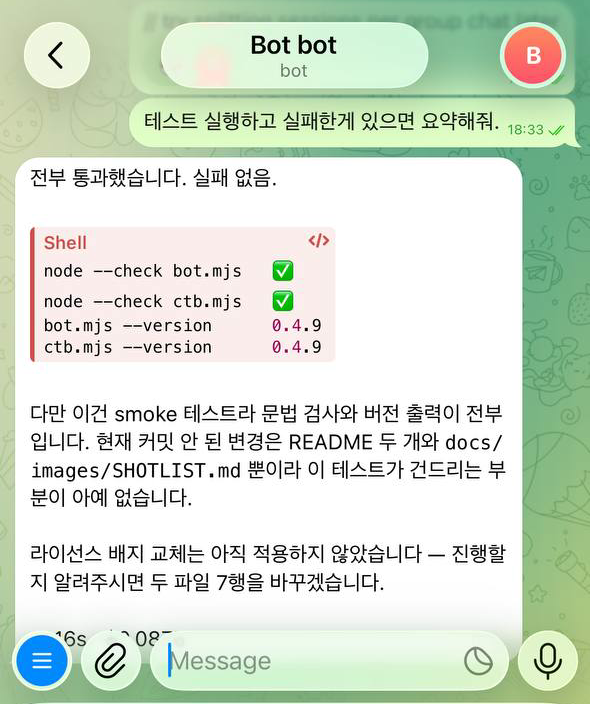
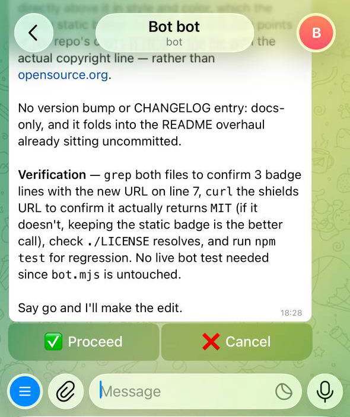
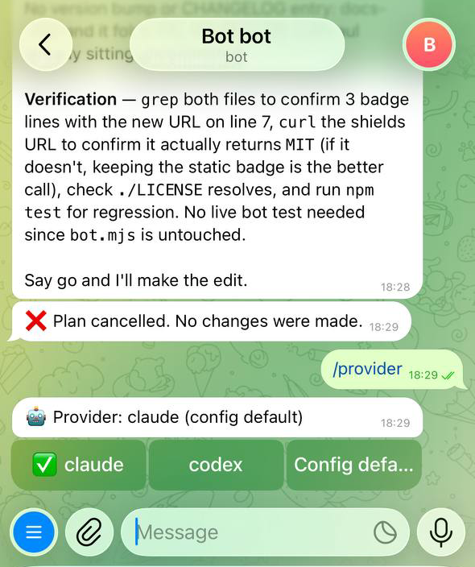
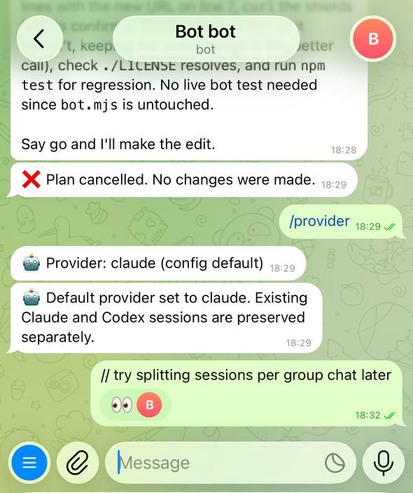

# Claude Telegram Bot

**한국어** · [English](./README.md)

[](https://www.npmjs.com/package/claude-telegram-bot)
[](https://www.npmjs.com/package/claude-telegram-bot)
[](./LICENSE)

텔레그램으로 Claude Code와 Codex를 — 어디서든, 어떤 기기에서도.

텔레그램 메시지를 집이나 서버의 코딩 agent가 처리하고 결과를 다시 채팅으로 보내는, 런타임 의존성 없는 백그라운드 봇입니다.

```text
  📱 텔레그램                        🖥  내 머신 — 백그라운드 데몬
  ─────────────────                  ──────────────────────────────────────
  "테스트 돌려줘"  ────────────────▶  bot.mjs  (롱폴링, 의존성 0)
                                       ├─ Claude  →  state.sessionId
                                       ├─ Codex   →  state.codexSessionId
                                       └─ Ollama     (모드 · 폴백)
                                              │
  "12개 통과, 1개 실패 …"  ◀──────────────────┘

  한도에 걸리면?   Claude ─▶ Codex ─▶ codex-handoff.md ─▶ 다음 Claude 호출
```

## 실제 화면

| 일을 시킨다 | 실행 전에 승인받는다 |
|-|-|
|  |  |
| 메시지 하나가 레포에서 실제 작업이 됩니다. | `/plan` 은 읽기 전용으로 돌고 ✅ / ❌ 를 기다립니다. |

| 버튼으로 provider 전환 | 봇이 무시하는 메모 |
|-|-|
|  |  |
| 타이핑 없이, 현재 것은 ✅ 표시. | `//` 로 큐에 넣지 않고 메모만 남깁니다. |

> ### ⚠️ 의도적으로 원격 코드 실행 도구입니다
> 텔레그램 메시지가 호스트 머신의 코드 실행으로 이어질 수 있습니다. 처음에는
> `permissionMode: acceptEdits`로 시작하고, 반드시 `allowedChatId`를 설정하세요. 상시 실행 전에
> [보안](#보안)을 읽어주세요.

**목차** — [빠른 시작](#3분-빠른-시작) · [왜 만들었나](#왜-만들었나) · [다른 도구와 비교](#다른-도구와-비교) · [설치](#설치--실행) · [설정](#설정) · [첫 실행](#첫-실행) · [사용 메모](#사용-메모) · [커스텀 명령어](#커스텀-명령어) · [예약 작업](#예약-작업-cron) · [여러 프로젝트 / 페르소나](#여러-프로젝트--페르소나) · [상시 실행](#상시-실행-launchd) · [보안](#보안)

## 3분 빠른 시작

필요한 것: **Node.js 18+**, 설치·로그인된 **Claude Code `claude` CLI**, `@BotFather`에서 받은 텔레그램 봇 토큰.

```sh
npm i -g claude-telegram-bot
claude-telegram-bot init ~/botconfigs/my-project
```

`~/botconfigs/my-project/mybot.json`을 수정합니다.

```json
{
  "token": "BOT_TOKEN_FROM_BOTFATHER",
  "allowedChatId": "",
  "projectDir": "/ABSOLUTE/PATH/TO/PROJECT",
  "claudeBin": "/ABSOLUTE/PATH/TO/claude",
  "permissionMode": "acceptEdits"
}
```

처음 한 번 실행해서 chat ID를 확인합니다.

```sh
claude-telegram-bot ~/botconfigs/my-project/mybot.json
```

텔레그램 봇에 아무 메시지나 보내면 봇이 `chatId`를 알려줍니다. 그 값을 `allowedChatId`에 넣고 재시작한 뒤, 이렇게 요청해보세요.

```text
테스트 돌려보고 실패한 부분 요약해줘
```

설치 없이 시험하려면 `npx claude-telegram-bot init`, `npx claude-telegram-bot`을 사용하면 됩니다.
Claude 대신(또는 함께) Codex를 쓰려면 [설정](#설정)을 참고하세요.

## 왜 만들었나

자리를 비운 사이에도 폰으로 빌드를 돌려보거나 간단한 수정을 맡기고 싶을 때가 있습니다. 그렇다고 외부에서 데스크톱에 원격 접속해서 터미널을 여는 건 번거롭죠.

텔레그램 봇이면 충분합니다. 메시지를 보내면 집(또는 개인 서버)의 선택된 provider가 헤드리스로 작업하고 답을 채팅으로 보냅니다. 별도 웹 대시보드나 데이터베이스는 없습니다.

## 이런 분께

- 외출·이동 중에 폰으로 테스트나 빌드를 돌려보고 싶은 분
- 자리를 비운 사이 간단한 수정·커밋을 맡겨두고 싶은 분
- 맥미니나 홈서버에 띄워두고 어디서든 접속하고 싶은 분
- 거창한 셀프호스트 구성 없이 텔레그램만으로 끝내고 싶은 분

OpenClaw처럼 웹 UI까지 갖춘 구성을 써봤다면, 이 프로젝트는 그 반대편이라고 보면 됩니다. 대시보드도 데이터베이스도 없고, 이미 설치해 로그인해 둔 Claude 또는 Codex CLI를 그대로 불러 씁니다.

## 동작 방식

- 텔레그램 봇 API를 롱폴링으로 받습니다.
- 메시지가 오면 작업 폴더(`projectDir`)에서 선택된 Claude 또는 Codex provider를 실행합니다.
- 두 provider는 별도 세션으로 이어지므로, 전환하거나 봇을 재시작해도 각각의 맥락이 유지됩니다.
- Claude 한도 도달 시 Codex 폴백을 쓸 수 있고, 처리 내용은 Claude용 handoff에 기록됩니다.
- 의존성이 없습니다. Node 18+ 내장 기능(`fetch`, `child_process`)만 씁니다.

## 다른 도구와 비교

이 분야에는 이미 여러 도구가 있고, Anthropic도 공식 기능을 내놨습니다. 용도에 맞게 고르시면 됩니다.

| | 이 봇 | [공식 Claude Code Channels](https://code.claude.com/docs/en/channels) | [claude-code-telegram](https://github.com/RichardAtCT/claude-code-telegram) |
|---|---|---|---|
| 런타임 | Node 내장만 | Bun + MCP 플러그인 | Python 3.11+ |
| 실행 모델 | 메시지마다 Claude 또는 Codex 헤드리스 프로세스 | 떠 있는 세션에 이벤트 push | Claude SDK / CLI |
| 상시 가동 | 백그라운드 데몬 | 인터랙티브 세션 유지 | 서비스 / 데몬 |
| 권한 차등 페르소나 | 가능 | 불가 | 불가 |
| 작업별 권한 승인 버튼 | 없음 | 있음 | 일부 |
| 기능 범위 | 최소 | 중간 | 많음 |

정리하면 이렇습니다.

- 작업마다 승인 버튼이 필요하고 세션을 계속 띄워둬도 괜찮다면 → **공식 Channels**
- 웹훅, cron, 음성 등 기능이 많이 필요하다면 → **claude-code-telegram**
- 구성을 최대한 단순하게 가져가고 싶거나, 한 코드로 여러 페르소나 봇을 굴리고 싶다면 → **이 봇**

## 요구 사항

- Node.js 18 이상 (내장 `fetch` 사용)
- 텔레그램 봇 토큰 ([@BotFather](https://t.me/BotFather)에서 발급)
- 최소 한 provider: Claude CLI 또는 Codex CLI 설치 및 로그인
- 선택 사항: Codex 폴백용 Codex CLI, Ollama 모드·폴백용 Ollama와 로컬 모델

상시 가동 예시는 macOS의 launchd 기준입니다. 리눅스라면 systemd나 pm2로 같은 구성을 만들면 됩니다.

## 설치 & 실행

라이브러리가 아니라 단독으로 도는 CLI입니다. `import`해서 쓰는 게 아니라, 전역으로 설치하거나 `npx`로 실행합니다. 작업 폴더는 설정의 `projectDir`로 정하므로, 봇을 어디에 설치하든 상관없습니다.

**npx로 바로 실행**

```sh
npx claude-telegram-bot init              # 현재 폴더에 mybot.json 생성
npx claude-telegram-bot init myapp.json   # 파일명 직접 지정도 가능
# 설정 편집 (token, projectDir 등)
npx claude-telegram-bot                   # mybot.json 으로 실행 (없으면 config.json 폴백)
```

**전역 설치 (상시 가동에 권장)**

```sh
npm i -g claude-telegram-bot

claude-telegram-bot init ~/botconfigs/myproj              # mybot.json 생성
claude-telegram-bot init ~/botconfigs/myproj/myapp.json   # 또는 파일명 지정
# 설정 편집
claude-telegram-bot ~/botconfigs/myproj/mybot.json
```

> **설정 파일은 git에 올리지 마세요.** config 파일에는 봇 토큰이 들어 있습니다. git 레포 안에 둔다면 `config.json`, `state*.json`, `attachments/`를 그 프로젝트의 `.gitignore`에 추가하세요. 이 레포는 해당 패턴을 이미 무시하므로 `claudebot.config.json` 같은 이름도 안전하지만, 다른 프로젝트는 직접 지정해야 합니다.

## 설정

`mybot.json`(또는 사용 중인 config 파일)의 키는 다음과 같습니다.

### 호환성

<details>
<summary><b>이 릴리스가 검증된 CLI 버전</b> — Claude Code 2.1.206 · Codex 0.144.1 · Ollama 0.31.1</summary>

이 봇은 CLI 옵션과 기계 판독용 출력 형식에 의존하므로 각 도구의 업데이트에 영향을 받을 수 있습니다.
아래는 2026-07-10에 호환성 기준으로 기록한 개발 환경 버전이며 강제 고정 버전이나 모든 경로의 통과를
보장하는 표는 아닙니다. 봇 호스트에 실제 설치된 버전은 `/status`에서 확인할 수 있습니다.

| CLI | 기록 버전 | 관련 연동 경로 |
|---|---:|---|
| Claude Code | `2.1.206` | JSON 출력, 세션 resume, 권한 모드 |
| Codex CLI | `0.144.1` | `exec`, `exec resume`, JSONL 이벤트, workspace sandbox |
| Ollama | `0.31.1` | `ollama launch claude`, 모델 선택, 세션 handoff |

CLI를 업데이트한 뒤에는 무인 실행에 맡기기 전에 `/testfallback`과 일반 Claude 메시지를 각각 확인하세요.
새 환경의 버전을 기록하고 두 경로를 확인한 뒤 이 표를 갱신하는 것을 권장합니다.

</details>

### 설정 키

시작에 꼭 필요한 건 `token`, `allowedChatId`, `projectDir`, `claudeBin`, `permissionMode` 다섯 개뿐이고
나머지는 전부 선택 사항입니다.

<details>
<summary><b>전체 설정 키</b> — provider · 폴백 · 모델 · 타임아웃 (30개 이상)</summary>

| 키 | 설명 |
|---|---|
| `token` | BotFather에서 받은 봇 토큰 |
| `allowedChatId` | 처음엔 비워두세요. 봇이 chatId를 알려줍니다 (아래 첫 실행 참고) |
| `projectDir` | 선택된 provider가 작업할 폴더의 절대경로 |
| `provider` | (선택) 텔레그램 메시지와 예약 작업의 메인 provider. `"claude"`(기본값) 또는 `"codex"` |
| `claudeBin` | `which claude` 결과 (절대경로 권장) |
| `permissionMode` | Claude 전용: `plan` / `acceptEdits` / `bypassPermissions` |
| `model` | Claude 모델. 비우면 CLI 기본값이며 Claude 활성 상태에서 `/model`로 전환 가능 |
| `lang` | (선택) UI 언어. 비우면 사용자별 자동 판별(기본 영어, 텔레그램이 한국어면 한국어). `"en"`/`"ko"`로 고정 가능 |
| `name` | (선택) `/help`에 표시되는 봇 이름. 여러 봇 구분용 |
| `persona` | (선택) 역할 시스템 프롬프트. 페르소나 봇 정의용 |
| `appendSystemPrompt` | (선택) 기본 "간결하게 답하기" 지침을 직접 덮어쓸 때 |
| `env` | (선택) provider 프로세스에 넘길 환경 변수 |
| `schedule` | (선택) 정해진 시각에 프롬프트를 실행하는 cron 작업 — [예약 작업](#예약-작업-cron) 참고 |
| `commands` | (선택) 쉘 스크립트를 실행하는 커스텀 `/명령어` — [커스텀 명령어](#커스텀-명령어) 참고 |
| `codexFallback` | (선택) `true`로 설정하면 Claude 레이트 리밋·크레딧 부족 시 Codex를 우선 폴백으로 사용 |
| `codexBin` | (선택) `codex` 실행 파일 경로. 기본값은 `PATH`의 `"codex"`이며 launchd에서는 절대경로 권장 |
| `codexModel` | (선택) Codex에 `--model`로 넘길 모델. Codex 활성 상태에서 `/model <전체-ID>`로 변경 가능 |
| `codexSandbox` | (선택) 첫 `codex exec` 세션의 샌드박스 (기본값: `"workspace-write"`) |
| `codexTimeout` | (선택) Codex 응답을 기다리는 최대 시간(ms). 실패하면 reserve/Ollama로 넘어감 (기본값: `600000`) |
| `ollamaFallback` | (선택) `true`로 설정하면 Claude 레이트 리밋·크레딧 부족 시 로컬 Ollama를 보조 폴백으로 사용 |
| `ollamaModel` | (선택) 폴백에 쓸 Ollama 모델 (기본값: `"qwen3.5:4b"`). 세션이 이어받는 맥락의 양은 이 모델의 런타임 컨텍스트 창(`num_ctx`)에 의해 제한됨 — 모델 아키텍처상 최대치와 무관하게 Ollama 기본값은 ~4K라, 긴 Claude 세션에는 부족함. `Modelfile`로 더 큰 창을 구워넣은 변형을 만들어(`FROM qwen3.5:4b` + `PARAMETER num_ctx 6144`, `ollama create qwen3.5:4b-ctx6k -f Modelfile`) 이 값으로 지정할 것. 크기는 RAM에 맞출 것 — 8GB 머신에선 ~6K가 안전 상한이고, 32K는 스왑으로 시스템이 먹통이 됨 |
| `ollamaBin` | (선택) `ollama` 실행 파일 경로. `/opt/homebrew/bin/ollama`, `/usr/local/bin/ollama`, `/usr/bin/ollama` 순으로 자동 탐색 후 없으면 `PATH`의 `"ollama"` 사용 — launchd로 뜨는 봇은 셸의 `PATH`를 상속받지 못하므로, 다른 경로에 설치했다면 명시적으로 지정할 것 |
| `ollamaTimeout` | (선택) Ollama 응답을 기다리는 최대 시간(ms) (기본값: `360000` — 로컬 모델은 콜드스타트가 느릴 수 있음) |
| `autoCompactThreshold` | (선택) 추정 컨텍스트 크기가 이 값을 넘으면 압축할지 물어봄 (기본값: `100000`). `0`이면 비활성화. 런타임에 `/autocompact`로 전환 가능(state에 저장) |
| `autoCompactConfirm` | (선택) 압축 전에 물어볼지 여부 (기본값: `true`). `false`면 임계값을 넘는 즉시 묻지 않고 바로 압축 |

같은 config로 로컬 대화형 세션도 실행할 수 있습니다. `ctb mybot.json`은 봇과 같은 provider를
따릅니다 — `/provider` override가 state에 있으면 그 값을, 없으면 `config.provider`를 씁니다.
명시적인 옵션은 해당 실행에서만 둘 다 덮어씁니다.

```sh
ctb mybot.json --provider claude
ctb mybot.json --provider codex
ctb mybot.json --chat -1001234567890   # 특정 방의 세션 재개
```

세션은 방별로 `state.sessions[chatId]` 아래에 저장됩니다 — Claude는 `sessionId`, Codex는
`codexSessionId`를 읽어 `codex resume <세션ID>`로 재개합니다. `ctb`는 기본적으로 `allowedChatId`의
첫 번째 방(보통 소유자 DM)을 이어받고, `--chat <id>`로 다른 방을 지정할 수 있습니다.
두 provider의 세션은 서로 분리됩니다. `/plan` 승인 흐름은 현재
`provider: "claude"`에서만 지원하며, 일반 메시지·첨부 파일·예약 작업은 둘 다 지원합니다.

`/provider`는 override를 state에 저장하므로 재시작 후에도 유지되지만 config 파일은 수정하지
않습니다. 로컬 `ctb`도 같은 override를 읽으므로 봇과 터미널이 같은 provider를 씁니다. 우선순위는
`--provider` 옵션 → state override → `config.provider` → `claude` 입니다.

`state`와 첨부 파일은 config 파일 옆 **`.claude-bot/` 숨김 폴더**에 저장됩니다(프로젝트 격리). 구버전에서 올리면 첫 시작 때 기존 `state.json`·`attachments/`를 `.claude-bot/`로 **자동 이동**합니다(무손실). 로그는 launchd plist가 가리키는 위치 그대로입니다.

</details>

## 첫 실행

1. **봇 토큰 발급** — 텔레그램에서 [@BotFather](https://t.me/BotFather)에게 `/newbot`을 보내고, 이름과 username(`_bot`으로 끝나야 함)을 정하면 토큰을 줍니다. `config.json`의 `token`에 넣고 `allowedChatId`는 비워둡니다.
2. **chatId 확인 후 잠그기** — 봇을 실행하고 텔레그램에서 아무 메시지나 보내면, 봇이 이 채팅의 `chatId`를 답장합니다. 그 숫자를 `allowedChatId`에 넣고 재시작하면 나만 쓸 수 있습니다. ([보안](#보안) 참고 — 이게 유일한 인증 수단입니다.)
3. **사용** — 그냥 메시지를 보냅니다.
   - `테스트 돌려보고 통과하면 커밋하고 push 해줘`
   - `api.ts 에 에러 핸들링 추가해줘`

주요 명령어:

| 명령어 | 기능 |
|---|---|
| `/provider [claude\|codex\|default]` | 텔레그램 봇 provider 확인·전환 |
| `/model [이름\|default]` | 활성 provider 모델 확인·전환, provider별 안내 표시 |
| `/new` | 활성 provider의 대화 세션 초기화 |
| `/plan <요청>` | 계획 작성 후 승인 대기 (Claude 전용) |
| `/compact` | 현재 컨텍스트 압축 (Claude 전용) |
| `/stop [--reset]` | 작업 중단, 선택적으로 이전 세션 ID 복원 |
| `/local [kill]` | 락을 물고 있는 로컬 `ctb` 세션 확인·텔레그램에서 종료 |
| `/ollama` · `/testfallback` | 로컬 모드 전환·fallback 연결 테스트 |
| `/status` | 버전, provider, CLI, 모델, fallback, 세션 상태 확인 |
| `/remember <내용>` · `/memory` | 영구 메모리 저장·확인 |
| `/cron` · `/reserve` | 예약 작업·한도 재시도 관리 |
| `/autocompact` · `/restart` · `/id` · `/help` | 유지관리·도움말 |

<details>
<summary><b><code>/plan</code> · <code>/stop</code> · <code>/local</code> · <code>/restart</code> 가 실제로 하는 일</b> — 봇을 믿고 맡기기 전에 알아둘 네 가지</summary>

> **`/plan <요청>`** 은 봇에 설정된 `permissionMode`와 무관하게 강제로 읽기 전용 plan 모드(편집·쉘 없음)로 요청을 실행하고, 계획 내용과 함께 **✅ 진행 / ❌ 취소** 버튼을 보냅니다. **진행**을 누르면 같은 세션을 봇의 실제 `permissionMode`로 이어서 승인된 계획을 실행하고, **취소**를 누르면 세션은 그대로 유지됩니다. `bypassPermissions` 봇이 뭔가 건드리기 전에 검토 단계를 두고 싶을 때 유용합니다. `/new`로 새 세션을 시작하면 대기 중인 승인은 만료됩니다.

> **`/stop`** 은 **그 방에서** 실행 중인 provider 프로세스를 즉시 종료하고 그 방의 대기 큐를 비웁니다. 다른 방의 작업은 그대로 계속됩니다. `--reset`을 붙이면 세션을 작업 시작 이전 상태로 되돌려 중단된 작업이 대화 맥락에 남지 않습니다.

> **`/local`** 은 로컬 `ctb` 터미널 세션이 머신 전체 락을 물고 있는지(PID·실행 경과 시간) 보여주고, 종료 버튼을 함께 보냅니다. 데스크탑에 `ctb`를 켜둔 채 나와서 봇이 모든 메시지에 "로컬 세션이 활성화되어 있습니다"로만 답할 때 쓰는 용도입니다. 버튼을 누르면 그 세션의 **프로세스 그룹**에 `SIGTERM`을 보냅니다 — 터미널에서 `Ctrl-C`를 누른 것과 같은 경로라 `ctb`가 락을 정상적으로 풀고 세션 요약 알림까지 보냅니다. 봇 작업이 없을 때 `/stop`을 쓰면 같은 버튼이 나옵니다. 버튼 없이 바로 끝내려면 `/local kill`.

> **`/restart`** 는 먼저 `bot.mjs` 에 `node --check` 를 돌려 **문법 오류가 있으면 재시작을 취소**합니다(잘못된 수정이 봇을 크래시 루프에 빠뜨리는 것 방지). 통과하면 프로세스를 종료하고, 다시 띄우는 건 프로세스 관리자에게 맡깁니다. [launchd 설정](#상시-실행-launchd)(`KeepAlive`)이면 바로 동작하고, 관리자 없이 `node bot.mjs` 로만 돌리면 그냥 멈춥니다. 재시작 후 대화 세션은 `state.json` 의 ID로 이어집니다. `/stop` 과 달리 재시작은 **방 단위가 아닙니다** — 프로세스를 통째로 내리므로 다른 방에서 돌던 작업도 같이 죽습니다. 작업 중이었거나 대기 메시지가 있던 방에는 중단 사실을 알리고, 놀고 있던 방은 건드리지 않습니다.

</details>

## 사용 메모

<details>
<summary><b>평소 동작 방식</b> — 세션 · 큐 · 그룹 채팅 · 첨부 파일 · 폴백 · 자동 컴팩션</summary>

- **세션 유지** — Claude와 Codex의 세션 ID를 따로 저장합니다. `/provider`로 전환해도 각각의 맥락이 유지되며 `/new`는 활성 provider 세션만 초기화합니다.
- **방별 세션 분리** — DM과 각 그룹은 서로 독립된 Claude·Codex 세션을 가집니다(`state.sessions[chatId]`). 한 방에서 한 얘기는 다른 방 세션에 넘어가지 않습니다. `provider`·`model` 같은 설정은 봇 전체 공용입니다.
- **그룹 채팅** — 그룹에서 쓰려면 봇을 **그룹 관리자로 지정**하세요. 텔레그램 privacy mode 때문에 일반 멤버 봇은 멘션·명령·답장만 받지만, 관리자 봇은 모든 메시지를 받아 멘션 없이 대화할 수 있습니다(또는 BotFather `/setprivacy`로 Disable). 그룹 안에서는 참여자 전원이 그 그룹의 단일 세션을 공유합니다. 명령어는 텔레그램이 그룹에서 붙여 보내는 `/명령@봇이름` 형태도 그대로 인식하며, 다른 봇을 향한 `/명령@다른봇`은 무시합니다.
- **방별 동시 실행** — 방끼리는 **병렬로** 돕니다. DM에서 긴 작업이 돌아도 그룹은 기다리지 않고, 반대도 마찬가지입니다. 방마다 세션이 독립적이라 서로 줄 세울 이유가 없습니다. 한 방 안에서는 여전히 한 번에 하나씩 처리합니다(아래 큐). 예약 작업은 전용 슬롯을 써서 예약끼리는 순서대로, 사용자 방과는 병렬로 돕니다. 로컬 `ctb` 세션은 여전히 머신 전체 락이라 모든 방이 멈춥니다 — 켜둔 채 나왔다면 `/local`로 텔레그램에서 끝낼 수 있습니다.
- **메시지 큐** — 그 방의 작업 중에 새 메시지가 오면 버리지 않고 큐에 쌓아둡니다. 작업이 끝나면 **같은 방**의 대기 메시지를 하나의 프롬프트로 합쳐서 처리합니다(예: "A 해줘" → "아니다 B 해줘"를 한 번에 처리). 합치는 건 항상 방 안에서만 일어나므로 세션이 섞일 일이 없습니다. `/stop`으로 그 방의 실행 중인 작업과 큐를 취소할 수 있습니다. 큐에 넣지 **않고** 그냥 적어두고 싶으면 메시지를 `//`로 시작하세요 — 봇이 완전히 무시하고 👀 리액션만 남기므로, 작업이 도는 동안 채팅에 혼잣말 메모를 남길 수 있습니다.
- **모델 설정** — `/model`은 활성 provider를 따르며 Claude와 Codex override를 별도로 저장합니다. Claude에서는 `fable`·`opus`·`sonnet`·`haiku` 별칭을 버튼으로 보여주고(현재 모델은 ✅) 기본값 버튼이 함께 나옵니다. Codex는 제안할 별칭이 없어 전체 모델 ID 입력을 안내하고 기본값 버튼만 보여줍니다. `/model <ID>` 타이핑도 그대로 동작하며, `/model default`는 활성 provider의 override만 해제합니다.
- **한도 초과 큐** — Claude Max / API 레이트 리밋 에러에 리셋 시간이 포함되면, 먼저 활성화된 폴백을 시도합니다. 폴백이 없거나 모두 실패할 때만 해당 메시지를 큐에 넣고 리셋 시각에 재시도합니다 — 작업 중 큐와 같은 방식입니다. 한도가 걸린 동안 추가로 보내는 메시지도 자동으로 큐에 쌓입니다. `/reserve`로 대기 현황과 리셋 시각 확인, `/reserve rm`으로 큐 전체 취소.
- **Codex 폴백** — `"codexFallback": true`로 설정하면 Claude 레이트 리밋·크레딧 부족 시 `codex exec`가 대신 실행됩니다. Codex는 `state.codexSessionId`에 별도 세션을 저장하고 `codex exec resume <id>`로 이어가지만, Claude 세션과 Codex 세션은 서로 호환되지 않습니다. 대신 성공한 Codex 폴백마다 `.claude-bot/codex-handoff.md`에 요약을 남기고, 이후 Claude 호출 때 최근 handoff 내용을 맥락으로 주입합니다.
- **실행 중 provider 전환** — `/provider`는 현재 provider(✅ 표시)와 함께 전환 버튼을 보내므로 타이핑이 필요 없습니다. `/provider claude`, `/provider codex`로 봇 state override를 직접 저장하는 방식도 그대로 동작하고, `/provider default`(또는 config 기본값 버튼)는 config 값으로 되돌립니다.
- **Ollama 폴백** — `"ollamaFallback": true`로 설정하고 `"ollamaModel"`에 로컬 [Ollama](https://ollama.ai) 모델을 지정하면(기본값: `"qwen3.5:4b"`), Codex가 꺼져 있거나 실패했을 때 보조 폴백으로 사용됩니다. `/ollama`로 Claude와 관계없이 로컬 모델을 기본 채팅 상대로 수동 전환할 수도 있습니다. 내부적으로 `ollama launch claude … --resume <세션>`을 사용하지만 로컬 모델 컨텍스트가 작으므로 최선 노력(best-effort)입니다.
- **자동 컴팩션** — 세션 컨텍스트 추정 크기가 `autoCompactThreshold`(기본값 100,000)를 넘으면 압축할지 물어보고 **🗜️ 지금 압축 / 나중에 / 끄기** 버튼을 함께 보냅니다. **나중에**를 누르면 컨텍스트가 25% 더 커지기 전까지 다시 묻지 않아서 매 턴 성가시게 굴지 않습니다. `autoCompactConfirm: false`로 두면 묻지 않고 바로 압축합니다. 크기 추정은 그 턴의 **마지막 API 호출** 값으로 합니다 — 턴 전체 토큰 합계는 도구 호출마다 컨텍스트를 다시 읽은 것까지 더해지므로, 파일 5개를 읽은 30k 대화가 160k로 잡혀 그것만으로 임계값을 넘습니다. config에서 임계값을 조정하거나, 런타임에 `/autocompact`로 설정합니다. 인자 없이 보내면 현재값과 함께 프리셋 버튼(50k / 100k / 150k / 200k / 끄기 / 기본값)이 나와서 휴대폰으로 숫자를 칠 필요가 없습니다. 값을 직접 줄 수도 있고 축약 표기를 받습니다 — `/autocompact 120k`, `/autocompact 120000`, `/autocompact 80,000` (`off`로 비활성화, `default`로 초기화). 10k~1m 범위를 벗어난 값은 거절하므로, `100m` 같은 오타로 자동 압축이 조용히 꺼지는 일은 없습니다. 설정값은 `state.json`에 저장돼 재시작 후에도 유지됩니다. 수동으로 `/compact`를 써도 됩니다. 압축은 1~2분 걸리며 다른 프롬프트와 동일한 락을 잡습니다 — 그동안 보낸 메시지는 대기열에 쌓였다가 끝난 뒤 처리됩니다.
- **간결한 답변** — 텔레그램에 맞게 짧게 답하도록 시스템 프롬프트가 기본으로 붙습니다. 바꾸려면 `appendSystemPrompt`에 직접 넣으세요 (빈 문자열이면 끔).
- **언어** — 봇 자체 문구(`/help`, 명령 메뉴, 상태 메시지)는 **기본 영어**, 텔레그램이 한국어인 사용자에겐 한국어로 나옵니다. `lang`(`"en"`/`"ko"`)으로 고정할 수 있습니다. Claude의 실제 답변은 **사용자가 쓴 언어**를 따라갑니다. `/` 명령 메뉴는 `setMyCommands`로 언어별 등록됩니다.
- **서식 변환** — 답변의 마크다운(굵게·코드·표 등)을 텔레그램 HTML로 바꿔 보냅니다. 변환이 깨지는 경우엔 평문으로 다시 보냅니다.
- **첨부 파일** — 사진·문서·음성·영상을 보내면 `attachments/`에 내려받고, 그 경로와 캡션을 활성 provider에 전달합니다.
- **이미지 전송(내보내기)** — 에이전트가 채팅으로 이미지를 *되돌려* 보낼 수 있습니다. 파일을 `.ctb-outbox/`(`projectDir` 아래)에 저장하고, 답변 끝에 `[[ctb-image: 파일명.png | 캡션(선택)]]` 형식의 줄을 붙이면, 봇이 그 마커를 텍스트에서 떼고 파일을 텔레그램 사진으로 보냅니다(여러 장이면 줄을 반복). 그 폴더 안의 순수 파일명만 허용하며 — `png/jpg/jpeg/gif/webp`, 10MB 이하 — 경로 탈출·폴더 밖을 가리키는 심볼릭 링크·다른 확장자는 거부합니다. 이 규칙은 시스템 프롬프트로 provider에 자동 안내됩니다. `"sendImages": false`로 기능 전체를 끌 수 있습니다.

</details>

## 커스텀 명령어

config에 `commands`를 정의하면 프로젝트별 `/명령어`로 쉘 스크립트를 실행하고 결과를 채팅으로 받을 수 있습니다. 정의한 명령어는 텔레그램 `/` 자동완성 메뉴에 자동 등록됩니다.

<details>
<summary><b>커스텀 명령어 레퍼런스</b> — 인자 전달 · 제한 · 실행 방식</summary>

```json
"commands": {
  "deploy": { "run": "npm run deploy", "description": "프로덕션 배포" },
  "logs":   { "run": "tail -n 50 ./app.log", "description": "최근 로그" },
  "status": { "run": "git status && git log --oneline -5", "description": "Git 상태" }
}
```

- **`run`** — 실행할 쉘 명령어. `projectDir`에서 실행됩니다.
- **`description`** — 텔레그램 `/` 자동완성 메뉴에 표시되는 설명
- **인자 전달**: `/deploy staging`처럼 뒤에 붙이면 명령어에 그대로 추가됩니다 (`npm run deploy staging`)
- Claude와 독립적으로 실행 — Claude 작업 중에도 동작합니다
- 출력은 최대 4,000자, 타임아웃 60초

</details>

## 예약 작업 (cron)

config에 `schedule` 배열을 두면 정해진 시각에 프롬프트를 자동 실행합니다 — 아침 브리핑, 주기적 점검, 리마인더 등. 각 항목은 프롬프트를 실행하고 결과를 `allowedChatId`로 보냅니다.

<details>
<summary><b>cron 레퍼런스</b> — 표현식 문법 · 조용한 작업 · 채팅에서 자연어로 추가하기</summary>

```json
"schedule": [
  { "cron": "0 9 * * 1-5", "label": "아침 브리핑", "prompt": "오늘 처리할 이슈/할 일을 요약해줘" },
  { "cron": "*/30 * * * *", "prompt": "CI 상태 확인해서 빨간 게 있을 때만 알려줘" }
]
```

- **`cron`** — 표준 5필드 `분 시 일 월 요일` (예: `0 9 * * 1-5` = 평일 09:00). `*`, 목록(`1,3,5`), 범위(`1-5`), 스텝(`*/15`)을 지원합니다. 요일 `0`과 `7`은 둘 다 일요일. 시각은 **호스트의 로컬 시간대** 기준입니다. 외부 의존성 없이 파서가 `bot.mjs` 안에 들어 있습니다.
- **`prompt`**(필수) — Claude에게 보낼 메시지. **`label`**(선택) — 답장 푸터와 `/cron` 목록에 표시되는 짧은 이름.
- **새 세션** — 예약 작업은 **독립된 세션**으로 돌아가서 내 대화 맥락을 오염시키지 않습니다(`state.json`은 내 것 그대로). 전용 슬롯에서 돌기 때문에 사용자 방과는 서로 기다리지 않지만, 예약끼리는 순서대로 돕니다 — 발사 시점에 다른 예약 작업이 아직 돌고 있으면 그 회차는 **건너뜁니다**(로그 남김).
- **조용한 작업(조건부 알림)** — Claude의 출력이 **비었거나 정확히 `SKIP`**이면 그 회차는 텔레그램으로 **아무것도 보내지 않습니다**. "조건이 맞을 때만 알리고 평소엔 조용히" 하고 싶을 때, 프롬프트에 *"조건이 아니면 다른 말 없이 `SKIP`만 출력해"* 라고 적으면 됩니다. 자주 도는 작업(예: 5분마다)도 스팸 없이 쓸 수 있습니다.

**채팅에서 자연어로 추가하기**

```
/cron add 매일 아침 9시에 열린 이슈 요약해줘
```

봇이 이 문장을 Claude에게 보내 cron 표현식으로 바꾸고, **해석한 내용을 되돌려 보여줍니다**(잘못 읽었으면 바로 확인 가능). 그리고 `state.json`에 저장하므로 **재시작이 필요 없습니다**. 동적 작업에는 번호가 붙고, 다음으로 관리합니다.

- `/cron` — 전체 목록 (config 작업은 `[config]`, 동적 작업은 `#번호`로 표시)
- `/cron add <자연어 요청>` — 예: `/cron add 30분마다 CI 빨간 거 있으면 알려줘`
- `/cron rm <번호>` — 동적 작업 삭제 (config 작업은 파일에서 수정)

config에 적은 작업은 바꾸려면 재시작이 필요하고, 채팅으로 추가한 작업만 즉시 반영됩니다.

</details>

## 여러 프로젝트 / 페르소나

코드는 프로젝트에 종속되지 않습니다. config 파일만 하나씩 더 만들면 여러 봇을 동시에 굴릴 수 있습니다.
**같은 프로젝트**를 역할별 봇으로 나눌 수도 있습니다 — 개발자 봇과 기획자 봇처럼요.

| 봇 | permissionMode | 역할 |
|---|---|---|
| 개발자 | `bypassPermissions` | 구현·수정·테스트·git |
| 기획자 | `plan` | 기능 제안·스펙·UX 방향 |

<details>
<summary><b>여러 봇 굴리기</b> — 프로젝트별 config · 토큰 · 페르소나 · 세션 격리</summary>

```sh
claude-telegram-bot ~/projects/A/claudebot.config.json   # 프로젝트 A
claude-telegram-bot ~/projects/B/claudebot.config.json   # 프로젝트 B
```

- 텔레그램은 토큰 하나당 폴링 하나만 허용합니다. 그래서 봇마다 BotFather 토큰을 따로 발급해야 합니다.
- `state`와 `attachments`는 config 옆에 저장되므로 봇끼리 섞이지 않습니다.

역할별로 나눌 때는 코드는 그대로 두고 config만 역할별로 둡니다.

- `persona`에 역할 프롬프트를 넣으면 그 봇의 정체성이 됩니다. (텔레그램용 간결 지침은 자동으로 같이 붙습니다.)
- 같은 폴더를 공유한다면 쉘을 쓰는 봇(`bypassPermissions`)은 하나로 제한하는 편이 안전합니다. 동시 편집 충돌을 피할 수 있습니다.
- `state` 파일 이름은 config 이름에서 만들어집니다 (`dev.config.json` → `dev.config.state.json`). 같은 폴더에 config가 여러 개여도 맥락이 안 섞입니다.

</details>

## 상시 실행 (launchd)

맥을 재부팅하거나 봇이 죽어도 자동으로 다시 뜨게 하려면 launchd를 씁니다. 로그인 세션에서 도는 LaunchAgent라서 `claude`의 키체인/OAuth 인증을 그대로 사용합니다.

<details>
<summary><b>launchd 설정 단계별</b> — 경로 확인 · 등록 · 관리</summary>

저장소의 `com.claudebot.example.plist`를 복사해 쓰면 됩니다. 먼저 경로부터 확인하세요.

```sh
which node     # ProgramArguments 첫 줄의 node 경로와 같은지
which claude   # 이 경로가 PATH(EnvironmentVariables)에 포함됐는지
```

plist에서 맞춰야 할 항목:

- `ProgramArguments` — node 절대경로, `bot.mjs` 절대경로, config 절대경로
- `WorkingDirectory` — 작업 폴더
- `EnvironmentVariables > PATH` — node·claude 경로 포함
- `StandardOutPath` / `StandardErrorPath` — 로그 파일 경로
- `Label` — 봇마다 고유하게 (예: `com.claudebot.myproj`)

등록과 관리:

```sh
cp com.claudebot.example.plist ~/Library/LaunchAgents/
launchctl bootstrap gui/$(id -u) ~/Library/LaunchAgents/com.claudebot.example.plist

launchctl list | grep claudebot      # 상태 확인 (PID가 보이면 실행 중)
tail -f bot.log                      # 로그

# 중지
launchctl bootout gui/$(id -u) ~/Library/LaunchAgents/com.claudebot.example.plist

# 코드 수정 후 재시작
launchctl bootout   gui/$(id -u) ~/Library/LaunchAgents/com.claudebot.example.plist
launchctl bootstrap gui/$(id -u) ~/Library/LaunchAgents/com.claudebot.example.plist
```

> 최신 macOS는 `bootstrap`/`bootout`을 권장합니다. 구버전 `load`/`unload`도 동작하지만 deprecated 경고가 뜰 수 있습니다.

</details>

## 자주 겪는 문제

- **`launchctl list`에 PID 없이 에러 코드만 보임** — `bot.error.log`를 확인하세요. 보통 node/claude 경로 문제이거나 config 누락입니다.
- **봇이 응답하지 않음** — `claude` 인증이 만료됐을 수 있습니다. 터미널에서 `node bot.mjs`를 직접 실행해 로그인 상태부터 확인하세요.
- **맥이 잠자기에 들어가면 폴링도 멈춤** — 시스템 설정 > 배터리/전원에서 절전을 풀어두세요.
- **폴링 오류 반복 (ETIMEDOUT)** — 일부 네트워크는 IPv6 경로가 막혀 있어 `fetch`가 타임아웃 납니다. `bot.mjs`는 IPv4를 우선하도록 이미 처리해 뒀습니다. 그래도 안 되면 `curl https://api.telegram.org`로 네트워크부터 확인하세요.

## 보안

이 봇은 **채팅으로 받은 메시지를 머신에서 명령으로 실행합니다.** 편한 만큼 위험하니 아래는 꼭 지키세요.

**누가 명령을 실행할 수 있나**

- **허가된 채팅** — `allowedChatId`로 허용한 텔레그램 계정에 접근할 수 있는 사람. 폰 잠금과 텔레그램 2FA를 켜두세요.
- **봇 토큰을 가진 사람** — 토큰은 봇의 비밀번호입니다. 토큰만으로 메시지를 읽고 봇을 사칭할 수 있습니다. `allowedChatId`가 명령 실행은 막아주지만(텔레그램이 주는 chatId는 위조 불가), 토큰이 새면 사고로 보고 `@BotFather`의 `/revoke`로 폐기하세요.
- **프롬프트 인젝션** — 외부 웹페이지나 파일을 봇에 넘겨 처리시키면, 그 안에 숨은 지시가 Claude를 조종할 수 있습니다. 신뢰할 수 없는 내용을 `bypassPermissions` 봇에 그대로 넣지 마세요.

**꼭 지킬 것**

- `allowedChatId`를 반드시 설정하세요. 설정 전에는 봇이 아무것도 실행하지 않고 chatId만 알려줍니다. 이게 유일한 인증 수단입니다.
- 토큰을 자격증명처럼 다루세요. 이슈·로그·스크린샷에 붙여넣지 마세요. 시작 로그는 토큰을 `<redacted>`로 가립니다.
- 봇 자체는 보안 경계가 아닙니다. Claude는 `permissionMode`, Codex는 `codexSandbox`를 사용하지만 두 프로세스 모두 데몬 사용자의 환경과 자격증명을 상속합니다.

**권한 모드 선택**

Claude와 Codex의 안전 설정은 서로 다르며 `/provider` 전환 시 실제 권한 경계도 달라질 수 있습니다. 아래 표는 Claude의 `permissionMode`입니다.

| 모드 | 허용 범위 | 권장 상황 |
|---|---|---|
| `plan` | 읽기·계획만 | Q&A, 코드 리뷰, 기획자 페르소나 |
| `acceptEdits` | 파일 편집 자동, 쉘 등은 제한 | 기본값으로 무난 |
| `bypassPermissions` | 쉘 포함 전부 자동 | 채팅 한 줄이 임의 코드 실행임을 감수할 때 |

- 자율 쉘·git이 꼭 필요한 게 아니면 `acceptEdits`를 쓰세요.
- `projectDir`는 홈 디렉터리가 아니라 특정 프로젝트를 가리키게 해 피해 범위를 줄이세요.
- 페르소나 봇을 여럿 둘 땐 하나만 `bypassPermissions`로 두고 나머지는 `plan`으로.
- 상시 가동한다면 전용 계정이나 VM도 고려해 보세요.
- Codex는 특별한 이유가 없다면 `codexSandbox: "workspace-write"`를 유지하세요.
- `/plan`, `/compact`, 자동 compact는 Claude 전용입니다.
- 커스텀 `/명령어`는 provider 설정과 무관하게 데몬 사용자 권한으로 직접 실행됩니다.

보안 이슈는 공개로 올리기보다 GitHub 이슈(민감한 내용은 메인테이너에게 비공개)로 알려주세요.

## 개발

```sh
npm test
```

smoke test는 CLI 파일에 `node --check`를 실행하고, 두 바이너리가 버전을 출력하는지 확인합니다. CI는 Node 18, 20, 22에서 같은 검사를 실행합니다.

최근 변경 사항은 [CHANGELOG.md](./CHANGELOG.md)를 참고하세요.

## 라이선스

MIT © Jongtaek Choi
