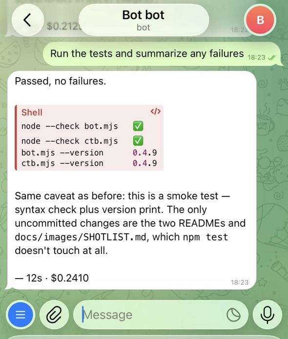

# Claude Telegram Bot

[한국어](./README.ko.md) · **English**

[](https://www.npmjs.com/package/claude-telegram-bot)
[](https://www.npmjs.com/package/claude-telegram-bot)
[](./LICENSE)

Use Claude Code or Codex from Telegram — run coding agents anywhere, from any device.

**A zero-dependency, daemonized Telegram bridge for Claude Code and Codex — no Bun, no Python, no open session.**

A small bridge that takes your Telegram messages, runs the selected coding provider in a project
folder, and sends the result back to the chat. It uses only Node 18+ built-ins, with no runtime
dependencies to install.

```text
  📱 Telegram                        🖥  your machine — background daemon
  ─────────────────                  ──────────────────────────────────────
  "run the tests"  ───────────────▶  bot.mjs  (long-polling, zero deps)
                                       ├─ Claude  →  sessions[room].sessionId
                                       ├─ Codex   →  sessions[room].codexSessionId
                                       └─ Ollama     (mode / fallback)
                                              │
  "12 passed, 1 failed …"  ◀──────────────────┘

  hit a rate limit?   Claude ─▶ Codex ─▶ codex-handoff.md ─▶ next Claude call
```

Drive a coding agent from your phone: run tests, edit files, commit, push — all from a chat.
It runs as a **background daemon** (launchd), so there's no interactive session to keep open.

## What it looks like

| Ask it to work | Approve before it acts |
|-|-|
|  |  |
| A message becomes a real task in your repo. | `/plan` runs read-only, then waits for ✅ / ❌. |

| Switch provider by tapping | Notes the bot ignores |
|-|-|
|  |  |
| No typing — the active one is marked ✅. | `//` leaves a note without queueing it. |

> ### ⚠️ This is a remote code-execution tool by design. Read the [Security](#security) section before running it.
> A message you send from Telegram is executed as a command on the machine running the bot.
> With `permissionMode: bypassPermissions`, a one-line message can run **anything** as your user.

**Contents** — [Quick start](#3-minute-quick-start) · [Why](#why-this-exists) · [How it compares](#how-it-compares) · [Security](#security) · [Install & run](#install--run) · [Configuration](#configuration) · [Custom commands](#custom-commands) · [Scheduled tasks](#scheduled-tasks-cron) · [Multiple projects](#running-multiple-projects) · [Personas](#multiple-personas-roles) · [Always-on](#always-on-with-launchd-macos)

## 3-minute quick start

Prerequisites: **Node.js 18+**, the **Claude Code `claude` CLI installed and authenticated**, and a Telegram bot token from `@BotFather`.

```sh
npm i -g claude-telegram-bot
ctb init ~/botconfigs/my-project
```

Installing gives you two commands, `claude-telegram-bot` and the shorter `ctb`. The rest of this
guide uses `ctb`.

Edit `~/botconfigs/my-project/mybot.json`:

```json
{
  "token": "BOT_TOKEN_FROM_BOTFATHER",
  "allowedChatId": "",
  "projectDir": "/ABSOLUTE/PATH/TO/PROJECT",
  "claudeBin": "/ABSOLUTE/PATH/TO/claude",
  "permissionMode": "acceptEdits"
}
```

Start once to discover your chat ID:

```sh
ctb bot ~/botconfigs/my-project/mybot.json
```

> `ctb bot` starts the bot daemon. Without `bot`, `ctb mybot.json` does something different — it
> takes over that bot's session **in your terminal**. Useful later, not now.
> (See [Configuration](#configuration).)

Send any message to the Telegram bot. It replies with your `chatId`. Put that value into `allowedChatId`, restart the bot, then send something useful:

```text
run the tests and summarize any failures
```

For a no-install trial, use `npx claude-telegram-bot init` and `npx claude-telegram-bot` instead. To
run Codex instead of (or alongside) Claude, see [Configuration](#configuration).

> **Running several things at once? Consider a group instead of a DM.** In a group with Topics
> turned on, each topic is its own room — separate session, separate queue, running in parallel —
> and `/newchat` opens a fresh one whenever you want to start something on the side. The cost: the
> bot has to be a group admin, and **everyone in that group can command it**. If it's just you, a
> DM is safer and needs no setup.
> Step by step, including the BotFather privacy setting: **[Using the bot in a group](docs/group-setup.md)**.
> Short version: invite the bot, and it posts the chat ID you need to paste into `allowedChatId`.

## Why this exists

Sometimes you are away from your desk but still want to ask a coding agent to inspect a repo, run
tests, make a small edit, or prepare a commit. Remote desktop and SSH are heavy for that; a Telegram
chat is enough.

This project is intentionally small: a CLI/daemon that reuses the `claude` and/or `codex` CLI already
authenticated on your machine. It is best for a Mac mini, home server, dev box, or personal VPS that
you already trust.

**Highlights**

- **Zero dependencies** — just Node 18+. No npm install, no supply chain.
- **Multi-project** — one codebase drives many projects via per-project config files.
- **Multi-persona** — split the *same* project into role-based bots (e.g. Developer + Planner)
  with per-bot system prompts and **differentiated permission levels**.
- **Session continuity** — conversations resume across restarts (`--resume`); `/new` to reset.
- **Provider switching** — use Claude or Codex as the main agent and switch with `/provider`.
- **Fallback handoff** — Codex can take over when Claude hits a limit and leave handoff notes.
- **Attachments** — send photos/docs/voice/video; they're saved locally and handed to the active provider.
- **Always-on** — ships with a launchd template for macOS (auto-start, auto-restart).

## How it compares

This space is crowded, and Anthropic now ships an official solution. Here's an honest map so you
can pick the right tool:

| | This bot | [Official Claude Code Channels](https://code.claude.com/docs/en/channels) | [claude-code-telegram](https://github.com/RichardAtCT/claude-code-telegram) |
|---|---|---|---|
| Runtime | **Node built-ins only** | Bun + MCP plugin | Python 3.11+ + libs |
| Execution model | headless Claude or Codex process per message | events pushed into an **open** `claude --channels` session | Claude SDK / CLI |
| Stays running as | **background daemon** (no session open) | a live interactive session you keep running | service / daemon |
| Multi-persona, permission-scoped bots on one repo | **yes** (dev=`bypass`, planner=`plan`) | no | no |
| Per-action permission approval (inline buttons) | no (set `permissionMode`) | **yes** | partial |
| Feature breadth (webhooks, cron, voice, export) | minimal | medium | **large** |
| Runtime dependencies | **none (Node built-ins)** | plugin runtime | Python packages |

**Use the official Channels** if you want per-action approvals and don't mind keeping a session
open. **Use claude-code-telegram** if you want maximum features. **Use this** if you want a
minimal, auditable, zero-dependency daemon — and especially if you want **role-split persona bots**
with different permission levels on the same project.

---

## Security

**Treat this tool like an SSH key into your machine that lives in a chat app.** It is designed
to execute commands; that power is the point, and also the risk. Read this before exposing it.

### Threat model — who can run commands on your machine

1. **The allowed chat.** Anyone with access to the Telegram account whose `chatId` you allow can
   run commands. Lock your phone and Telegram account (2FA). If the allowed chat is a **group**, that
   means every member of it — the whitelist is per *room*, not per person, so adding someone to the
   group hands them the bot. **This applies identically to rooms opened with `/allow`** — a chat added
   from your DM has exactly the same access as one written into `config.json`.
2. **Whoever holds the bot token.** The token is the bot's password. With it, an attacker can read
   incoming messages and impersonate the bot. The `allowedChatId` whitelist still blocks command
   *execution* (Telegram-supplied `chatId`s can't be forged), but **treat a leaked token as an
   incident**: revoke it via `@BotFather` → `/revoke` and issue a new one.
3. **Prompt-injected content.** If you forward a webpage, file, or repo issue and ask the bot to act
   on it, malicious instructions inside that content can steer Claude. Don't pipe untrusted content
   into a `bypassPermissions` bot.

### Non-negotiables

- **Always set `allowedChatId`.** Until you do, the bot refuses to run anything and just replies
  with the chat's ID. Once set, only that chat can issue commands — this is your only auth layer,
  so it must be set.
- **Guard the token like a credential.** `config.json` and `state.json` are in `.gitignore` so you
  don't commit it — keep it that way. Never paste the token into issues, logs, or screenshots. The
  startup log redacts it (`token: <redacted>`); don't add it back.
- **The bot itself is not a security boundary.** Provider controls reduce risk but do not isolate
  Telegram, custom commands, or the daemon process. Claude runs with `permissionMode`; Codex uses
  `codexSandbox`. Both processes still inherit the daemon user's environment and credentials.

### Choose the least permission you can live with

Claude and Codex use different safety controls. Switching provider can therefore change the
effective permission boundary.

For Claude, `permissionMode` is the main safety dial:

| Mode | What it allows | Use when |
|---|---|---|
| `plan` | Read & plan only, no edits | Q&A, code review, a "planner" persona |
| `acceptEdits` | Auto-approve file edits; other actions (shell, etc.) still gated | **Recommended default** — useful but bounded |
| `bypassPermissions` | Everything auto-runs, **including arbitrary shell** | You accept that one chat message = arbitrary code execution |

Practical hardening:

- Prefer `acceptEdits` over `bypassPermissions` unless you specifically need autonomous shell/git.
- Point `projectDir` at a **specific project**, not your home directory — limit the blast radius.
- For multi-persona setups, give only **one** bot `bypassPermissions`; keep the rest on `plan`.
- Consider running on a dedicated user account or VM if you'll leave it always-on.
- For Codex, keep `codexSandbox: "workspace-write"` unless you understand the implications of a
  broader sandbox setting. `/plan`, `/compact`, and automatic compact are currently Claude-only.
- Custom `/commands` run directly as the daemon user; neither `permissionMode` nor `codexSandbox`
  restricts them.

### Reporting a vulnerability

Found a security issue? Please open a GitHub issue (or contact the maintainer privately for
sensitive reports) rather than posting exploit details publicly.

---

## Install & run

This is a standalone CLI/daemon, **not a library** — you don't `import` it. Install it globally (or
run via `npx`), point a config file at any project, and run it. `projectDir` in the config decides
which folder Claude works in, independent of where the bot is installed.

Prerequisites: **Node 18+**, a Telegram bot token, and at least one configured provider. Install and
authenticate the **Claude CLI** for Claude, the **Codex CLI** for Codex or Codex fallback, and
**Ollama plus a local model** only if you enable Ollama mode/fallback.

**Option A — npx (no install)**

```sh
npx claude-telegram-bot init             # writes ./mybot.json
npx claude-telegram-bot init myapp.json  # or pick your own filename
# edit the config (token, projectDir, …)
npx claude-telegram-bot                  # runs ./mybot.json (falls back to config.json)
```

**Option B — global install (recommended for an always-on daemon)**

```sh
npm i -g claude-telegram-bot

claude-telegram-bot init ~/botconfigs/myproj             # writes ~/botconfigs/myproj/mybot.json
claude-telegram-bot init ~/botconfigs/myproj/myapp.json  # or a custom filename
# edit the config (token, projectDir, …)
claude-telegram-bot ~/botconfigs/myproj/mybot.json
```

A global install also puts the shorter `ctb` on your PATH. `ctb init …` is the same command; the
daemon is `ctb bot …` (plain `ctb` starts a [local session](#configuration), not the daemon).

Run several projects/personas by making one config file each and passing its path — state and
attachments live in a `.claude-bot/` folder next to that config, so they don't mix.

> **Keep your config out of git.** The config file holds your bot token. If you drop one inside a git
> repo, add it (plus `.claude-bot/`) to *that* project's `.gitignore`. This repo already ignores
> `config.json`, `config.*.json`, `*.config.json`, `.claude-bot/`, and the pre-`.claude-bot/` layout
> (`state*.json`, `attachments/`), so any name like `claudebot.config.json` is covered here — but
> your own project won't ignore them until you say so.

### First-run steps

**1) Create a bot token** — In Telegram, open `@BotFather` → `/newbot` → pick a name and a
`username` ending in `_bot` → copy the token (looks like `123456789:AA...`). Put it in `mybot.json`,
leave `allowedChatId` empty for now.

**2) Find your chatId and lock the bot to it** — Start the bot (`claude-telegram-bot …`), send it any
message in Telegram; it replies with this chat's `chatId`. Put that number into `mybot.json`
`allowedChatId` and restart. Now only you can use it. (See [Security](#security) — this is your only
auth layer.)

**3) Use it** — just send messages:

- `run the solver tests and commit + push if they pass`
- `add an edge case to solve-2nd-floor-edges.ts`

Core commands:

| Command | Purpose |
|---|---|
| `/provider [claude\|codex\|default]` | View or switch this room's provider override |
| `/model [name\|default]` | View or switch this room's active-provider model |
| `/new` | Reset the conversation session — both Claude and Codex, so a fallback can't resume the old context |
| `/newchat [name]` *(or `/newtopic`)* | Open a **new forum topic** in this group and start a fresh session there (needs Topics on + the bot's *Manage topics* permission) |
| `/sessions` | List past sessions in **this room's working folder** for the active provider and pick one to carry on from (🔒 held by another room, 💻 open in a terminal — both are blocked; with `personas`, only this room's role is listed, ❓ = predates roles) |
| `/name <name>` | Name the current session so it stands out in `/sessions` (`/name -` removes it) |
| `/jobs` | Background jobs that outlive replies — ▶ running, ✅ finished |
| `/persona` | The role this room runs as, and the prompt behind it (view only — you change it from the buttons at `/new`) |
| `/tell [room] [message]` | Hand a message to another room this bot runs — it executes there, with that room's session. Sent bare, it lists the rooms |
| `/plan <request>` | Produce a plan and wait for approval (Claude only) |
| `/plan on` · `/plan off` | Pin plan mode to this room — every message plans first (Claude only) |
| `/compact` | Compact the current context (Claude only) |
| `/stop [--reset]` | Stop the task; optionally restore its previous session ID |
| `/local [kill]` | Show which room a local `ctb` session is holding, and end it from Telegram |
| `/ollama` | Toggle local Ollama chat mode |
| `/testfallback` | Test the configured Codex or Ollama fallback |
| `/status` | Show version, provider, CLI versions, model, fallback, and session state |
| `/remember <text>` · `/memory` | Save or inspect persistent memory (`/memory rm <n>` drops lines — `3`, `3 5 7`, or `3-9`) |
| `/cron` · `/reserve` | Manage scheduled jobs and usage-limit retries |
| `/allow` | Chats allowed to use this bot, with where each came from · `/allow <chatId>` opens one (in effect immediately, no restart) · `/allow rm <chatId>` closes it. **Owner only** — the gate is your Telegram user id, not the room, and neither the agent nor `ctb send` can reach it. `[config]` entries are read-only here: edit the file and `/restart` |
| `/autocompact` · `/mergewindow` · `/restart` · `/id` · `/help` | Maintenance and help commands |

> **A removed rule can look like it's still in effect** — that's expected. `/memory rm` drops the
> line from the `RULES` block injected on every call, but the **conversation already in progress**
> still contains answers that followed it. An LLM takes its own earlier replies as a style example,
> so the habit carries on by context inertia even after the instruction is gone. Start a fresh
> session with `/new` to clear it fully.
>
> Adding and removing are asymmetric this way: `/remember` takes effect on the very next reply,
> while a removal lands more slowly the longer the conversation is. It's most visible for rules
> that show up in **every** answer (tone, output format); a rule like "always confirm before
> deploying" leaves no trace in the context and so doesn't have this problem.

<details>
<summary><b>What <code>/plan</code>, <code>/stop</code>, <code>/local</code> and <code>/restart</code> actually do</b> — the four commands worth knowing before you rely on the bot</summary>

> **`/plan <request>`** runs the request in read-only plan mode (no edits, no shell) regardless of
> the bot's configured `permissionMode`, and replies with the plan plus **✅ Proceed / ❌ Cancel**
> buttons. Tapping **Proceed** resumes the same session with the bot's normal `permissionMode` and
> tells Claude to implement the approved plan; **Cancel** leaves the session untouched. This gives
> you a review step before a `bypassPermissions` bot touches anything. The pending approval expires
> if you start a new session with `/new` first.

> **`/plan on`** pins that to the room: until you send `/plan off`, every message plans first and
> comes back with the same approval buttons, so you stop having to remember the prefix. It is a
> per-room setting stored alongside `provider`/`model`, so it survives a restart and one topic can
> be pinned while another is not. Approving runs with the bot's normal `permissionMode` — approval
> ignores the pin, otherwise an approved plan would just be planned again. Two things to know:
> plan mode is Claude-only, so the pin does nothing while a room is on Codex (`/status` says so),
> and while pinned the bot will **not** fall back to Codex on a Claude rate limit, since that would
> quietly turn a planning request into one that edits files.

> **`/stop`** kills the provider process running **in that room** and clears that room's queued
> messages. Other rooms keep running untouched. Add `--reset` to also restore the session to the
> state it was in *before* the task started, so the conversation history doesn't include the
> interrupted work.

> **`/local`** shows whether a local `ctb` terminal session is holding a room (which room, its PID
> and how long it has been running) with a button to end it. That's for the case where you walked
> away from the desk with `ctb` still open and that room answers with "a local session has this room
> open" — other rooms keep working, so this only blocks the one you left behind:
> tapping the button sends `SIGTERM` to the session's process group — the same path as pressing
> `Ctrl-C` in that terminal, so `ctb` releases the lock and still sends its end-of-session handoff.
> `/stop` offers the same button when no bot task is running. Use `/local kill` to skip the button.

> **`/restart`** runs `node --check` on `bot.mjs` first and **aborts the restart if it has a syntax
> error** (so a bad edit can't crash-loop the bot), then exits — relying on a process supervisor
> to relaunch it. Works out of the box with the [launchd setup](#always-on-with-launchd-macos)
> (`KeepAlive`); under a bare `node bot.mjs` with no supervisor it just stops. Your session resumes
> after the restart (the id lives in `state.json`). Unlike `/stop`, a restart is **not** room-scoped —
> it takes the whole process down, so any task running in another room dies with it. Rooms that had a
> task running or messages queued get told; idle rooms aren't bothered.

</details>

**4) Keep it always on (optional)** — see [Always-on with launchd](#always-on-with-launchd-macos).

> **From source** (for hacking on the bot): clone the repo, `cp config.example.json mybot.json`,
> then `node bot.mjs [mybot.json]`. Same behavior as the CLI.

---

## Compatibility

<details>
<summary><b>CLI versions this release was tested against</b> — Claude Code 2.1.246 · Codex 0.149.1 · Ollama 0.32.14</summary>

The bot depends on CLI flags and machine-readable output that may change between releases. These are
the development-environment versions recorded as the compatibility baseline on 2026-08-26; they are
reference versions, not strict pins or a claim that every path passes. Use `/status` to see the
versions actually installed on the bot host.

| CLI | Recorded version | Checked | Relevant integration |
|---|---:|:---:|---|
| Claude Code | `2.1.246` | ✅ | JSON output, session resume, permission mode |
| Codex CLI | `0.149.1` | ✅ | `exec`, `exec resume`, JSONL events, workspace sandbox |
| Ollama | `0.32.14` | — | `ollama launch claude`, model selection, session handoff |

"Checked" means the path was actually exercised when the version was recorded — a normal Claude
message for Claude Code, `/testfallback` for Codex. Ollama is version-recorded only: the baseline
environment runs `codexFallback`, so the Ollama path was not exercised this round.

When upgrading one of these CLIs, run `/testfallback` and a normal Claude message before relying on
the bot unattended. Update this table after recording the new environment and checking those paths.

</details>

## Configuration

```sh
cp config.example.json mybot.json
```

The only keys you need to start are `token`, `allowedChatId`, `projectDir`, `claudeBin`, and
`permissionMode` — everything else is optional.

<details>
<summary><b>All configuration keys</b> — providers, fallbacks, models, timeouts (30+ options)</summary>

| Key | Description |
|---|---|
| `token` | Bot token from BotFather |
| `allowedChatId` | **Leave empty at first** → the bot tells you (step 2). Required before it runs anything. |
| `projectDir` | Absolute path to the working folder the selected provider runs in |
| `provider` | (optional) Main provider for Telegram messages and scheduled jobs: `"claude"` (default) or `"codex"` |
| `claudeBin` | Output of `which claude` (absolute path recommended) |
| `permissionMode` | Claude-only: `plan` / `acceptEdits` / `bypassPermissions` — see [Security](#security) |
| `model` | Claude model. Empty = CLI default. Override with `/model` while Claude is active. |
| `lang` | (optional) UI language. Empty = auto-detect per user (English default, Korean for Korean Telegram clients). Force with `"en"` / `"ko"`. |
| `name` | (optional) Bot name shown in `/help` — handy for telling multiple bots apart |
| `persona` | (optional) Role system prompt — defines a persona (developer/planner/…). See below |
| `personas` | (optional) A **list** of roles, so one bot can run several. Each needs `id` (`[a-z0-9-]`, becomes a filename), `prompt`, and optionally `name`, `model`/`provider`, and `dir` (its own working folder, relative to `projectDir`). Rooms pick one at a session boundary; rooms that never pick run as the first. See below |
| `appendSystemPrompt` | (optional) Override the default "be concise for Telegram" instruction |
| `env` | (optional) Extra environment variables passed to provider processes |
| `mergeWindowMs` | (optional) Wait this long for a follow-up message and answer both at once (default: `1000`; `0` runs each message immediately). Override at runtime with `/mergewindow` (persists in state). |
| `schedule` | (optional) Cron jobs that run a prompt on a timer — see [Scheduled tasks](#scheduled-tasks-cron) |
| `commands` | (optional) Custom `/commands` that run shell scripts — see [Custom commands](#custom-commands) |
| `sendImages` | (optional) Let the agent send images back to the chat via `.ctb-outbox/` (default: `true`). Set to `false` to turn the whole feature off. |
| `backgroundJobs` | (optional) Watch detached jobs registered in `.ctb-jobs/` and report them via `/jobs` (default: `true`). Set to `false` to turn the whole feature off. |
| `roomRelay` | (optional) Let `/tell` and the agent hand a message to another room this bot runs (default: `true`). Set to `false` to turn the whole feature off. |
| `cliDispatch` | (optional) Listen on a local unix socket (`.claude-bot/ctb.sock`, mode 0600) so `ctb send` can hand the running bot a message (default: `true`). Set to `false` to not open it. |
| `codexFallback` | (optional) `true` to enable Codex as the preferred fallback when Claude is rate-limited or out of credits |
| `codexBin` | (optional) Path to the `codex` binary. Defaults to `"codex"` on `PATH`; use an absolute path for launchd |
| `codexModel` | (optional) Codex model passed with `--model`; `/model` shows the models available to the installed Codex CLI as buttons. Empty/default lets the CLI choose and is safest. |
| `codexSandbox` | (optional) Codex sandbox for a new `codex exec` session (default: `"workspace-write"`) |
| `codexTimeout` | (optional) Milliseconds to wait for Codex before falling back to reserve/Ollama (default: `600000`) |
| `ollamaFallback` | (optional) `true` to enable Ollama as a secondary fallback when Claude is rate-limited or out of credits |
| `ollamaModel` | (optional) Ollama model to use for fallback (default: `"qwen3.5:4b"`). The context a session carries over is capped by this model's runtime context window (`num_ctx`), which Ollama defaults to ~4K regardless of the model's architectural max — too small for a long Claude session. Bake a larger window into a variant with a `Modelfile` (`FROM qwen3.5:4b` + `PARAMETER num_ctx 6144`, `ollama create qwen3.5:4b-ctx6k -f Modelfile`) and point this at it. Size it to your RAM — on an 8 GB machine ~6K is the safe ceiling; 32K swaps the machine to death. |
| `ollamaBin` | (optional) Path to the `ollama` binary. Auto-detected at `/opt/homebrew/bin/ollama`, `/usr/local/bin/ollama`, `/usr/bin/ollama`, falling back to `"ollama"` on `PATH` — set this explicitly if your install lives elsewhere, since a launchd-run bot doesn't inherit your shell's `PATH` |
| `ollamaTimeout` | (optional) Milliseconds to wait for an Ollama reply before giving up (default: `360000` — local models can be slow to cold-start) |
| `autoCompactThreshold` | (optional) Offer to compact when the estimated context size exceeds this value (default: `100000`). Set to `0` to disable. Override at runtime with `/autocompact` (persists in state). |
| `autoCompactConfirm` | (optional) Ask before compacting instead of doing it silently (default: `true`). Set to `false` to compact automatically as soon as the threshold is crossed. |
| `ctbNotify` | (optional) Post a handoff message to the resumed room when a local `ctb` session ends (default: `true`). Set to `false` to stay silent. |
| `ctbNotifyTimeout` | (optional) How long to wait for the handoff answer, in ms (default: `180000`). Large sessions take longer to resume; raise this if `ctb` reports the handoff timed out. |

The same config also drives local interactive sessions. `ctb mybot.json` follows the provider and
model overrides of the room selected by `--chat` (or the first `allowedChatId`), then falls back to
the config defaults. An explicit provider flag overrides that room for the invocation:

```sh
ctb mybot.json --provider claude
ctb mybot.json --provider codex
ctb mybot.json --chat -1001234567890   # resume a specific room's session
```

Room ids are not memorable, and forum topics add one per `/newchat`, so plain `ctb` asks which room
to continue — arrow keys or `1`-`9`, enter to start, `q` to cancel:

```
Pick a room  (↑↓ or 1-9, enter to start, q to cancel)
❯  1  Ada Lovelace       688344084          claude  4ef8162d  *
   2  Bot dev            -1002233445566     claude  5e6637a7
   3  Bot dev / release  -1002233445566:11  codex   019f49c4
   4  (unnamed)          -5360343684        claude  ff09b344  (not in allowedChatId)
```

`*` marks the default room, and the room id in the middle column is what `--chat` takes. A room
whose chat is no longer whitelisted is flagged rather than hidden — that is what an old chat id
left behind by a group-to-supergroup upgrade looks like.

The prompt is skipped whenever the answer is already settled — only one room exists, `--chat` named
one, arguments like `-p "…"` were passed, or stdin is not a terminal (background jobs, pipes). So
scripted use is unchanged.

The name comes from what the room is called in Telegram; the bot records it the first time it
answers there, so rooms last used before this feature show as `(unnamed)` until they see a message.
Topic names only reach the bot when the topic is created or renamed, so a topic that already existed
is listed as `Bot dev / #11` (the thread id) — enough to tell it apart from General — and picks up
its real name if one turns up later.

Sessions are stored per room at `state.sessions[chatId]` — Claude under `sessionId`, Codex under
`codexSessionId` (resumed with `codex resume <session-id>`). `ctb` resumes the first entry of
`allowedChatId` (usually your DM) unless `--chat <id>` names another room. The sessions remain
separate. `ctb` also passes your `persona` and the `/remember` rules to Claude on every run, so a
terminal session behaves like the bot even right after `/new`, when there is no prior conversation
to carry the persona. Telegram-only wording (reply brevity, image sending, model-upgrade hints) is
left out, and Codex has no `--append-system-prompt`, so this applies to `provider: "claude"` only.

**Handing the running bot a job — `ctb send`.** The commands above run Claude *in your terminal*;
the bot knows nothing about it. `ctb send --chat <room> "<message>"` does the opposite: it hands the
message to the **already-running bot** over a local unix socket, and the bot runs it in that room —
typing indicator, that room's session and settings, the answer posted there. From the outside it is
indistinguishable from a message you typed into Telegram, and the answer also comes back on stdout
so a script can use it.

```sh
ctb send --chat planning "draft the release note for 0.5.0"
```

The room can be its key or any distinctive part of its name. By default the target room is asked to
approve with ✅/❌ first — the caller may well be an agent, and a process cannot tell a human-typed
`ctb` from one a model invoked, so the safe default applies to both; `--now` skips it for unattended
scripts and the room is told either way. It refuses to target the room your own `ctb` session is
holding (the bot defers that room, so the message would sit in the queue until you quit), and a
message pushed this way cannot be relayed onward. If no bot is running it fails outright rather than
quietly falling back to a local run. A terminal session started with `ctb` is *told* this channel
exists — the usage and the list of rooms it may reach are appended to its system prompt, but only
while the bot is actually running, so a terminal used without the bot pays nothing for it. Turn the
socket off with `"cliDispatch": false`. Design notes:
[CLI dispatch](docs/design/cli-dispatch.md).

When the terminal session ends, `ctb` asks it one last question — not "summarize what you did" but
"the conversation continues on Telegram; is there anything to hand over?" — and posts the answer to
**the room whose session it resumed** (the one printed as `Resuming … (chat <id>)` on startup), so a
DM session's notes no longer land in your groups. The reply is capped at three lines and the session
can decline with `SKIP`, which keeps the notification worth reading. Turn it off with
`"ctbNotify": false`.

The `/plan` approval workflow currently
requires `provider: "claude"`; normal messages, attachments, and scheduled jobs support both.

`/provider` and `/model` store overrides in that room's state, survive bot restarts, and do not
rewrite the config. Other DMs, groups, and forum topics keep their own settings. Local `ctb` reads
the selected room's overrides; provider precedence is `--provider` flag → room override →
`config.provider` → `claude`.

State and downloaded attachments live in a hidden **`.claude-bot/`** folder next to the config
file, so projects stay isolated. Upgrading from an older version **auto-moves** an existing
`state.json` / `attachments/` into `.claude-bot/` on first start (no data loss). Logs stay wherever
your launchd plist points them.

Persistent memory (`/remember`) lives there too, and since 0.4.13 its filename is derived from the
config name the same way state is — `config.json` → `memory.md`, `planner.json` →
`planner.memory.md`. Two bots run from one folder no longer read each other's rules. A named config
that was already using the shared `memory.md` gets it **copied** once on first start and the
original is left in place, because no code can tell which line belonged to which bot — keep both
and trim each side with `/memory rm`.

</details>

### Usage details

<details>
<summary><b>How the bot behaves day to day</b> — sessions, queueing, group chats, attachments, fallbacks, auto-compact</summary>

- **Concise mode**: a `--append-system-prompt` is applied by default so replies stay short for
  Telegram. Override it via `appendSystemPrompt` (empty string disables it).
- **Language**: the bot's own messages (`/help`, command menu, status text) are English by default
  and switch to Korean for users whose Telegram client is Korean. Force one language with `lang`
  (`"en"`/`"ko"`). Claude's actual replies follow the language you write in, regardless. The `/`
  command menu is registered per-language via `setMyCommands`.
- **Formatting**: the reply's Markdown (bold/code/headings/tables) is converted to Telegram-safe
  HTML. If conversion ever produces invalid HTML, the message is automatically resent as plain text.
- **Attachments**: send a photo/document/voice/video and it's downloaded into `.claude-bot/attachments/`; the
  absolute path is handed to the active provider (caption included as the message).
- **Sending images (outgoing)**: the agent can send an image *back* to the chat. It saves the file
  into `.ctb-outbox/` (under `projectDir`) and adds a line at the end of its reply in the form
  `[[ctb-image: filename.png | optional caption]]`. The bot strips the marker from the visible text
  and delivers the file as a Telegram photo (repeat the line for several images). Only bare filenames
  inside that folder are accepted — `png/jpg/jpeg/gif/webp`, ≤10 MB; path traversal, symlinks escaping
  the folder, and other file types are rejected. The provider learns this convention automatically via
  the system prompt. Disable the whole feature with `"sendImages": false`.
- **Background jobs**: the agent runs as a fresh process per message and exits when its reply is sent —
  anything it launched in the background dies with it. So work that must outlive the reply (dev servers,
  long builds, watchers) is detached with `nohup … & disown` and registered in `.ctb-jobs/` as a
  `<name>.json` record plus a `<name>.log`. The bot **watches but never owns** these jobs: every 30s it
  checks each PID with `kill(pid, 0)` and messages the chat when one exits, with the tail of its log.
  Because the bot doesn't own them, `/restart` doesn't kill them, and the watcher picks them back up on
  boot. `/jobs` lists them; the same records are produced whether the job was started from Telegram or
  from a local `ctb` session. Disable with `"backgroundJobs": false`.
- **Handing a message to another room**: rooms hold separate sessions, so what one room worked out is
  invisible to the next. `/tell <room> <message>` pushes one message across — `/tell` on its own lists the
  rooms this bot knows (any room it has already talked in), and the room can be given as its number in that
  list or any distinctive part of its name (topic names like `Cube / Marketing` contain spaces, so a
  fragment is usually what you want). It runs in the target room under *that* room's session, provider,
  model, and pinned plan mode, queues if the room is busy, and the answer stays there — nothing is echoed
  back. The agent can hand one over too, by ending its reply with `[[ctb-tell: room | message]]`; that path
  asks in the target room and waits for ✅ before running, because it is the point where the model starts
  spending another room's tokens. A message that arrived from another room can never be relayed onward
  (one hop), which together with that approval means no relay chain runs without a person in it. Muted
  rooms (`/*`) are never targeted. Disable with `"roomRelay": false`.
  Design: [Room-to-room relay](docs/design/room-relay.md).
- **Sessions**: Claude and Codex keep separate session IDs, so switching providers preserves both
  conversations. `/new` resets only the active provider's session.
- **Per-room sessions and settings**: your DM, each group, and each forum topic hold independent Claude/Codex sessions plus provider and model overrides (`state.sessions[roomKey]`). Switching `/provider` or `/model` in one room does not change another room. `/provider default` and `/model default` clear only that room's override and return it to the config default.
- **The parent topic asks instead of running**: in a forum group, opening the chat drops you in the parent topic ("All" view), and a reply typed there goes to the *parent's* session rather than the topic you were reading — a structural trap, not carelessness. So once a forum group has topics the bot knows about, the parent topic stops running prompts and asks which room they're for, with one button per sibling topic plus **Run here** and **Drop**. Nothing runs until you tap, so a mistake becomes *not sent* rather than *sent to the wrong session*. Attachments, captions, and the sender come along unchanged — the receiving topic sees exactly what you would have typed there. There is nothing to turn on: it applies only where all three are true (forum group · parent topic · at least one known sibling topic), so DMs, ordinary groups, and forums without topics are untouched. Design: [parent-topic desk](docs/design/room-router.md).
- **Forum topics are rooms too**: in a supergroup with Topics enabled, each topic gets its own session, queue, and running task (`state.sessions["<chatId>:<topicId>"]`) — replies land back in the topic they came from. The General topic and ordinary groups keep the plain `chatId` key, so nothing changes for them. Turning Topics on upgrades a basic group to a supergroup, and Telegram issues it a **new chat ID** — the bot follows that migration automatically (sessions included) and tells you to update `allowedChatId`, but only for a chat that was already allowed. `/newchat [name]` (or `/newtopic`) creates a topic and starts fresh there; the bot needs the *Manage topics* permission, and since the Bot API can't create groups, a topic is as close to a "new room" as a bot can get. Without a name, the topic is stamped with the current date and time.
- **Group chats**: to use the bot in a group, make it a **group admin**. Telegram's privacy mode limits a non-admin bot to mentions, commands, and replies, but an admin bot receives every message so you can talk to it without @mentioning it each time (alternatively, disable privacy mode via BotFather `/setprivacy`). Everyone in the group shares that group's single session. Commands also work in the `/command@BotName` form Telegram appends in groups; a `/command@SomeOtherBot` addressed to a different bot is ignored. Invite the bot to a room that isn't in `allowedChatId` and it posts that room's chat ID plus where to paste it — **once per room**, so it can't be turned into a spam relay, and it still runs nothing there. Full walkthrough: [Using the bot in a group](docs/group-setup.md).
- **Per-room concurrency**: rooms run **in parallel** — a long task in your DM doesn't block a group, and vice versa. Each room holds its own session, so there's nothing to serialize across them. Within a single room, messages still run one at a time (queued and merged, below). Scheduled jobs get their own slot: they serialize against each other but run alongside your rooms. A local `ctb` terminal session pauses only the room it holds, so the rest keep answering — `/local` shows which room that is and ends it from Telegram if you left it open.
- **Consecutive messages are merged**: people split one thought across messages — "about that bug" / "run the tests first" / "oh and the logs too". Rather than firing on the first line and making the rest queue behind a run whose context is half missing, the bot waits **1 second** for a follow-up (`mergeWindowMs`, `0` disables). Each new message reopens the window, capped at 5× so a busy room can't stall forever; typing shows up immediately so the pause doesn't read as a dead bot. A log pasted past Telegram's 4096-character limit is split by the sending client into several messages, and the first part lands more than a second ahead of the rest — the client waits for its acknowledgement before pushing the remainder, so the follow-up fragments arrive back-to-back but the opening one does not. A plain 1-second window therefore runs on that first fragment alone and queues the actual content behind it. So a message that arrives sitting at the length limit is read as "more is coming" and held for up to 8 seconds instead; the closing fragment is shorter, which drops the window straight back to normal, so the paste is answered as one prompt without making ordinary messages wait. Commands are never delayed — `/status` and `/stop` still answer at once, and `/stop` cancels a window that hasn't fired yet. A held message is written to `state.json` while the window is open and picked up again on the next boot — unlike a queued message it never got a ⏳ receipt, and the Bot API cannot re-fetch a message once it has been delivered, so dropping it on a restart would lose it for good. Tune it without a restart via `/mergewindow` — sent bare it shows the current value with preset buttons (0.5s / 1s / 2s / 3s / 5s / Off / Default); `/mergewindow 2s`, `/mergewindow 2000`, `off` and `default` also work, and values outside 0.1s–30s are rejected. The override persists in `state.json`.
- **Message queue**: if you send a message while that room's task is running, it is queued (not dropped). When the task finishes, queued messages **from the same room** are merged into a single prompt so Claude can resolve corrections and follow-ups in one pass (e.g. "do X" then "never mind, do Y" → handled together). Merging is only ever within a room, so it can't mix sessions. Use `/stop` to cancel that room's running task and discard its queue. To jot something down **without** it being queued, start the message with `//` — the bot ignores it entirely (it only reacts with 👀), so you can leave yourself notes in the chat while a task runs. For a run of several notes or a pasted log, send `/*` once: every message in that room is ignored until one starts with `*/`. The mode is per-room and survives a restart, so a restart can't dump your notes into the session — and since each ignored message still gets a 👀, it stays obvious that the block is still open.
- **Models**: `/model` follows the room's active provider and stores separate Claude/Codex overrides for that room. On Claude it shows the `fable`, `opus`, `sonnet`, and `haiku` aliases as buttons (current one marked ✅) plus a Default button; on Codex it shows the models the installed CLI offers your account as buttons. Typing `/model <id>` still works, and `/model default` clears only that room's active-provider override.
- **Setting menus expire on your next message**: the buttons from `/model`, `/provider`, `/autocompact`, `/mergewindow`, `/sessions` and the auto-compact prompt are a snapshot of the state at the moment they were sent. When a new message arrives in that room the bot strips the buttons off the previous menu, so scrolling back and tapping an old one can't silently revert a setting you changed since. It's tracked per room, and the **`/plan` approval and `/local` kill buttons are left alone** — those are requests still waiting on an answer.
- **Usage-limit queue**: when a Claude Max / API rate-limit error includes a reset time, the bot first tries enabled fallbacks. If no fallback is enabled or every fallback fails, the triggering message is queued and retried at that time — just like messages queued while Claude is busy. Any additional messages you send during the limit window are also added to the queue. Use `/reserve` to check queue status and reset time, `/reserve rm` to cancel and clear the queue.
- **Codex fallback**: set `"codexFallback": true` to run `codex exec` when Claude is rate-limited or out of credits. Codex keeps its own session in that room's `state.sessions[roomKey].codexSessionId` using `codex exec resume <id>`, but Claude and Codex sessions are not interoperable. Each successful Codex fallback appends a summary to `.claude-bot/codex-handoff.md`, and future Claude calls receive the recent handoff notes as context.
- **Per-room provider switching**: `/provider` shows that room's active provider (marked ✅) with buttons to switch — no typing needed. `/provider claude` / `/provider codex` affect only the current DM, group, or forum topic; `/provider default` returns only that room to the config value. Each provider's session is preserved separately.
- **Ollama fallback**: set `"ollamaFallback": true` and point `"ollamaModel"` at a locally-installed [Ollama](https://ollama.ai) model (default: `"qwen3.5:4b"`). Ollama is now a secondary automatic fallback when Codex is disabled or fails, and `/ollama` still toggles local chat mode manually. It runs Claude Code through the local model via `ollama launch claude … --resume <session>`, but this remains best-effort because local model context windows are much smaller than Claude's.
- **Auto-compact**: the bot estimates how large the session context has grown. When it exceeds `autoCompactThreshold` (default 100 000), the bot asks whether to compact, with **🗜️ Compact now / Later / Off** buttons. **Later** snoozes the prompt until the context grows another 25%, so it doesn't nag you every turn. Set `autoCompactConfirm: false` to skip the question and compact immediately. The estimate is taken from the *last* API call of the turn, not the turn's total token usage — the total is summed across every tool call, so a 30k conversation that read five files reports 160k and would trip the threshold on its own. Tune the threshold in config, or at runtime with `/autocompact` — sending it with no argument shows the current value with preset buttons (50k / 100k / 150k / 200k / Off / Default) so you don't have to type digits on a phone. You can still pass a value directly, in shorthand or in full: `/autocompact 120k`, `/autocompact 120000`, `/autocompact 80,000` (`off` to disable, `default` to reset). Values outside 10k–1m are rejected, so a typo like `100m` can't silently switch auto-compact off. The override persists in `state.json` across restarts. You can also run `/compact` manually at any time. Compaction takes a minute or two and holds the same lock as any other prompt — messages you send while it runs are queued and handled once it finishes. **While a plan is waiting for approval the question is held back**: compacting starts a new session, so tapping *Compact now* first would expire the very plan you were about to approve — and with `/plan on` pinned that collision comes up every turn. The prompt returns once the plan is cancelled or has expired; approving it runs the plan and the next answer decides again. A manual `/compact` still goes through, but now tells you the pending plan expired instead of leaving a dead button behind.

</details>

### Custom commands

Define project-specific `/commands` in config that run shell scripts and return their output to the chat. Commands appear in Telegram's `/` autocomplete menu automatically.

<details>
<summary><b>Custom command reference</b> — arguments, limits, execution model</summary>

```json
"commands": {
  "deploy": { "run": "npm run deploy", "description": "Deploy to production" },
  "logs":   { "run": "tail -n 50 ./app.log", "description": "Recent logs" },
  "status": { "run": "git status && git log --oneline -5", "description": "Git status" }
}
```

- **`run`** — any shell command, executed in `projectDir`
- **`description`** — shown in the Telegram `/` autocomplete menu
- **Arguments**: `/deploy staging` appends `staging` to the command (`npm run deploy staging`)
- Scripts run independently of Claude — they work even when Claude is busy
- Output capped at 4 000 characters; 60-second timeout

</details>

### Scheduled tasks (cron)

Add a `schedule` array to the config to run prompts on a timer — daily briefings, periodic
checks, reminders. Each entry runs the prompt and sends the result to `allowedChatId`.

<details>
<summary><b>Cron reference</b> — expression syntax, silent jobs, adding jobs from the chat in plain language</summary>

```json
"schedule": [
  { "cron": "0 9 * * 1-5", "label": "Morning brief", "prompt": "Summarize today's open issues and TODOs" },
  { "cron": "*/30 * * * *", "prompt": "Check CI status; only reply if something is red" },
  { "cron": "0 9 * * 1,4", "chat": "-1001234567890", "label": "Planning report",
    "prompt": "Write the twice-weekly planning report" }
]
```

- **`cron`** — standard 5-field expression `minute hour day-of-month month day-of-week`
  (e.g. `0 9 * * 1-5` = 09:00 on weekdays). Supports `*`, lists (`1,3,5`), ranges (`1-5`),
  and steps (`*/15`). Day-of-week `0` and `7` both mean Sunday. Times use the **host's local
  timezone**. No external dependency — the parser lives in `bot.mjs`.
- **`prompt`** (required) — the message sent to Claude. **`label`** (optional) — a short name
  shown in the reply footer and in `/cron`.
- **`chat`** (optional) — a room key, or an array of them. The job then runs **with that room's
  role** (its `personas` entry and that role's `/remember` rules, its provider and model) and the
  result goes **only there**. Without it the job runs role-less and the result is broadcast to every
  `allowedChatId` — fine for a single-role bot, but once you give a bot several roles, an untargeted
  job runs as the *first* role and posts into every room, so a planning report ends up written by
  the developer role and pasted into the developer's group. Room keys must be in `allowedChatId`
  (forum topics like `-100…:11` are checked against their group); a job naming an unknown room is
  **dropped at startup with an error in the log** rather than posting somewhere unintended. Muted
  rooms are skipped. Jobs added at runtime with `/cron add` have no `chat`.
- The job still runs in the cron slot with **no session** even when `chat` is set — it borrows the
  room's role and address, not its conversation, so it can't be caught by that room's plan lock or
  queue.
- **Fresh session**: scheduled jobs run in their **own session** so they never pollute your
  interactive conversation context (`state.json` stays yours). They run in their own slot, so
  they don't wait on your rooms (and your rooms don't wait on them) — but they serialize against
  each other, so a job is **skipped** if another scheduled job is still running when it fires.
  A local `ctb` session skips them too: scheduled jobs don't run while one holds the lock.
- **A skipped run says so.** Either way the bot posts one line to the room the job would have
  reported to — with a button to end the local session when that's the cause. It used to be logged
  only, so a missed run was invisible unless you read the log. Repeats are capped at one notice per
  job per hour so a frequent job can't flood the room.
- **Silent jobs (conditional alerts)**: if Claude's output is **empty or exactly `SKIP`**, that run
  sends **nothing** to Telegram. To get "alert only when it matters, stay quiet otherwise," tell the
  prompt to *output just `SKIP` when the condition isn't met*. This lets even frequent jobs (e.g.
  every 5 minutes) run without spamming the chat.

**Add jobs from the chat — in plain language:**

```
/cron add summarize open issues every weekday at 9am
```

The bot asks Claude to turn that into a cron expression, **echoes back what it understood**
(so you can catch a misread), and saves it to `state.json` — **no restart needed**. Dynamic
jobs get an id; manage them with:

- `/cron` — list everything (config jobs are tagged `[config]`; dynamic ones show `#id`)
- `/cron add <plain-language request>` — e.g. `/cron add every 30 min, ping me if CI is red`
- `/cron rm <id>` — remove a dynamic job (config jobs are edited in the file)

Config-defined jobs still require a restart to change; only chat-added jobs are live.

</details>

---

## Running multiple projects

The code is project-agnostic: make **one config file per project** and run several at once.

<details>
<summary><b>Multi-project setup</b> — one config per project, one BotFather token each</summary>

- Run: `node bot.mjs /absolute/path/to/project.config.json` (no arg → `./mybot.json`, fallback `./config.json`)
- State, attachments, and `/remember` memory live in **`.claude-bot/` inside the config file's
  folder**, with state and memory filenames derived from the config name, so projects don't mix.
- **Note**: Telegram allows only one poller per token → each project needs its **own BotFather
  token**.
- For always-on, copy the launchd template per project (see below).

Example — two projects:

```
~/projects/A/claudebot.config.json   (token A, projectDir=~/projects/A)
~/projects/B/claudebot.config.json   (token B, projectDir=~/projects/B)
node bot.mjs ~/projects/A/claudebot.config.json   # instance A
node bot.mjs ~/projects/B/claudebot.config.json   # instance B
```

</details>

## Multiple personas (roles)

You can split the **same project** into roles (e.g. **Developer** + **Planner**) — either as
**one bot whose rooms have different roles**, or as **a separate bot per role**.

**Rooms as roles** (`personas` in the config) is usually the one you want: one process, one Telegram
identity, and `/tell` can hand work between roles because they're the same bot — separate bots
**cannot** talk to each other at all (Telegram bots don't receive other bots' messages).

```jsonc
"personas": [
  { "id": "dev",     "name": "Developer", "prompt": "You are the senior developer on this project. …" },
  { "id": "planner", "name": "Planner",   "prompt": "You are the product/UX planner. …" }
]
```

A role is **fixed for the life of a session** — everything said so far belongs to it — so you pick
one only at a session boundary. The bot offers buttons at all three: a room's **first message**,
**`/newchat`**, and **`/new`**. Ignore them and the room simply runs as the first role in the list.
Picking applies that role's prompt **and its own `/remember` memory** (`memory.dev.md`).

`/status` shows the room's role in one line; `/persona` shows the prompt behind it. Neither changes
it. With no `personas` key nothing changes at all — `persona` keeps working exactly as before.

`/sessions` respects roles too. Its list comes from session files on disk, scanned per project, so
without this it would offer **every room's** sessions — carrying a planning session into a dev room
would quietly bypass the session-boundary rule. Sessions started before you added `personas` have no
role recorded; they stay in the list marked **❓**, and picking one files it under the current room's
role from then on.

### A role can have its own working folder (`dir`)

Add `dir` to a role and that room runs in that folder — relative to `projectDir` (absolute paths work
too). Leave it out and the room uses `projectDir` exactly as before.

```jsonc
"projectDir": "/Users/me/code",
"personas": [
  { "id": "dev",   "name": "Developer", "prompt": "…" },
  { "id": "alpha", "name": "Alpha",     "prompt": "…", "dir": "projects/alpha" },
  { "id": "notes", "name": "Notes",     "prompt": "…", "dir": "/Users/me/notes" }
]
```

This is how **one bot covers several projects**. The biggest win is that the folder's own
`CLAUDE.md` comes along — a role becomes *its config prompt + that folder's project rules*. Everything
that hangs off the working folder follows the room: the child process's `cwd`, `/sessions`
(sessions are scanned per folder, so different folders separate on their own), `.ctb-outbox` and
`.ctb-jobs` (one pair per folder — `/jobs` watches all of them and tags which project each job is
from), and `ctb --chat <room>` in the terminal.

Subfolders of `projectDir` are recommended but not required. Note that `.ctb-outbox`/`.ctb-jobs` are
created inside **each** working folder, so scattered folders each need their own `.gitignore` entry.

If a role's `dir` does not exist, **that room refuses to run** and says so; the folder is not created
for you and the room does not fall back to another role's folder — either would quietly edit the
wrong project. Create the folder (or fix `dir` and `/restart`) and it comes back.

Permissions are still global (`permissionMode`, `codexSandbox`). Per-role permissions are a separate
piece of work — see [docs/design/room-personas.md](docs/design/room-personas.md).

**A separate bot per role** still makes sense when you need two identities in one group at the same
time, when you're migrating gradually, or when `allowedChatId` must differ. That layout is below.

| Bot | permissionMode | Role |
|---|---|---|
| Developer | `bypassPermissions` | Implement, edit, test, git |
| Planner | `plan` (read/plan only) | Feature proposals, specs, UX direction |

<details>
<summary><b>Persona setup</b> — system prompts, permission split, session isolation</summary>

- **`persona`**: a role system prompt in the config becomes that bot's identity. The concise-Telegram
  instruction is injected automatically, so `persona` only needs the role itself.
- **Differentiated permissions via `permissionMode`**: since the bots share a folder, keep the
  shell-using bot (`bypassPermissions`) to **just one** to avoid concurrent-edit conflicts. For
  read/plan-only, use `plan`.
- **Session isolation**: the `state` filename is derived from the config name
  (`mybot.json` → `mybot.state.json`, `dev.config.json` → `dev.config.state.json`), so multiple configs
  in one folder don't share context.
- **One token per bot**: each bot needs its own BotFather token (`allowedChatId` can be the same).

Example — Developer + Planner:

```
dev.config.json       (permissionMode: bypassPermissions, persona: "Senior developer...")
planner.config.json   (permissionMode: plan,              persona: "Product/UX planner...")
node bot.mjs dev.config.json
node bot.mjs planner.config.json
```

> For always-on, copy `com.claudebot.example.plist` **per bot** and register each with a distinct
> `Label`, config argument, and log paths (see below).

</details>

---

## How to run

| Method | When terminal closes | After reboot | On crash | Use for |
|---|---|---|---|---|
| `node bot.mjs` | stops | ✗ | ✗ | testing, finding chatId |
| `nohup node bot.mjs > bot.log 2>&1 &` | survives | ✗ | ✗ | quick background run |
| **launchd (LaunchAgent)** | survives | ✅ auto-start | ✅ auto-restart | **always-on (recommended)** |

> `node bot.mjs &` also backgrounds it, but closing the terminal kills it (SIGHUP). Use `nohup` to
> survive that, and launchd to survive reboots/crashes.

## Always-on with launchd (macOS)

Keeps the bot alive across reboots and crashes. It runs as a **LaunchAgent** in your login session,
so it reuses Claude's keychain/OAuth auth.

<details>
<summary><b>launchd setup, step by step</b> — check paths, register, manage</summary>

### 1. Check the plist (paths / node version)

`com.claudebot.example.plist` assumes certain paths — fix them first if yours differ:

```sh
which node     # must match the node path in ProgramArguments
which claude   # its directory must be on PATH (EnvironmentVariables)
```

Items to verify in the plist:

- `ProgramArguments` [0] — absolute path to `node`
- `ProgramArguments` [1] — absolute path to `bot.mjs`
- `WorkingDirectory` — the project folder
- `EnvironmentVariables > PATH` — includes your node/claude directories
- `StandardOutPath` / `StandardErrorPath` — log file paths

> **These paths are frozen at setup time.** If you use a version manager (nvm, fnm, asdf), the node
> path contains a version number — upgrading node later leaves the plist pointing at the old one, and
> the bot keeps running on it **silently**, no error anywhere. Same for `PATH`, which is how the bot
> finds `claude`. After a node upgrade, re-run `which node` and compare, or check a running bot with
> `ps -eo args | grep bot.mjs`.

### 2. Register & start

```sh
cp com.claudebot.example.plist ~/Library/LaunchAgents/
launchctl bootstrap gui/$(id -u) ~/Library/LaunchAgents/com.claudebot.example.plist
```

> Modern macOS prefers `bootstrap`/`bootout`. The old `load`/`unload` still works but may print a
> deprecation warning. If `bootstrap` fails, fall back to
> `launchctl load ~/Library/LaunchAgents/com.claudebot.example.plist`.

### 3. Manage

```sh
launchctl list | grep claudebot      # registered/running? (a PID means it's up)
tail -f bot.log                      # run log
tail -f bot.error.log                # error log

# stop
launchctl bootout gui/$(id -u) ~/Library/LaunchAgents/com.claudebot.example.plist

# restart after editing code (bootout → bootstrap)
launchctl bootout   gui/$(id -u) ~/Library/LaunchAgents/com.claudebot.example.plist
launchctl bootstrap gui/$(id -u) ~/Library/LaunchAgents/com.claudebot.example.plist
```

</details>

### Troubleshooting

- **`launchctl list` shows an error code with no PID** → check `bot.error.log`. Usually a node/claude
  path issue (`command not found`) or a missing config file (`mybot.json`).
- **Bot doesn't respond, but `claude` works fine in your terminal** → the credentials have **split in
  two**. Claude Code can keep them in the macOS keychain *and* in `~/.claude/.credentials.json`, and
  which one is read depends on how the process was started: a bot under **launchd reads the keychain**,
  while a **terminal falls back to the file** (it can't reach the keychain). Logging in from a terminal
  therefore refreshes only the file — and because logging in rotates the refresh token, the keychain
  copy can no longer renew itself. The bot dies with *"OAuth session expired and could not be
  refreshed"* while every terminal test passes. Fix:
  `security delete-generic-password -s "Claude Code-credentials"`, then restart the bot.
  The bot checks for this at startup and every 6 hours, and DMs the owner — so you should hear about
  it before a room does.
- **Mac is asleep → polling stops** → disable sleep in System Settings > Battery/Power.
- **Repeated "polling error" (ETIMEDOUT)** → some networks block IPv6, so Node's fetch times out
  against api.telegram.org (which has an IPv6 address). `bot.mjs` already works around this by
  preferring IPv4 (`dns.setDefaultResultOrder('ipv4first')` + disabling auto-select). If it still
  fails, check the network/firewall with `curl https://api.telegram.org`.

---

## Requirements

- Node.js 18+ (for built-in `fetch`)
- A Telegram bot token from `@BotFather`
- At least one provider: authenticated Claude CLI or authenticated Codex CLI
- Optional: Codex CLI for Codex fallback; Ollama and a downloaded model for Ollama mode/fallback

## Development

```sh
npm test
```

That runs two things. The **smoke** check runs `node --check` on the CLI files and verifies both
binaries print their version. Then `tests/*.test.mjs` runs the behaviour suites.

`bot.mjs` is one file with no exports, so the suites **cut blocks out of the source** and run them
over stubs — testing the real code rather than a copy that quietly drifts from it. The trade-off is
that an anchor can move; when it does, `cut()` fails naming the anchor instead of dying with a
stray `SyntaxError`. Each suite is its own process, so one broken anchor doesn't hide the rest.

CI runs the same checks on Node 18, 20, and 22.

See [CHANGELOG.md](./CHANGELOG.md) for recent changes.

## License

MIT © Jongtaek Choi
